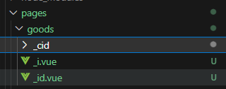
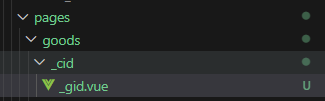
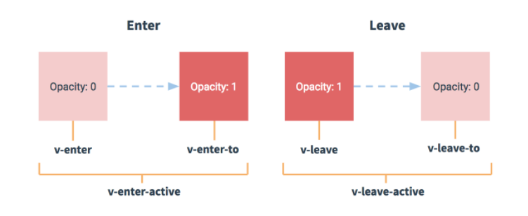

# 1.Nust 脚手架项目

## 1.1安装

```
yarn create nuxt-app 项目名
```

## 1.2启动

```
yarn install
yarn dev
```

## 1.3客户端和服务端渲染区别

1.客户端渲染的网站，是要经过JS动态生成HTML和内容。但是爬虫在爬取网站时，JS无法执行,导致爬虫无法收录网页的内容，不利于SEO优化

2.服务端渲染：网页上的内容在服务端已经渲染好了，浏览器是直接拿到服务器渲染好的页面，直接呈现给用户，有利于爬虫爬取网页内容，有利于SEO优化


## 1.4nuxt脚手架项目

1.components目录下的组件，在pages目录中的页面组件中直接使用


nuxt.config.js

```
  components: true, //自动在页面导入组件
```


# 2.页面组成

1. 布局文件： layouts/default.vue  默认布局文件就是 default.vue
2. 布局文件中，使用  <Nuxt /> 占位  可以看成 vue-router
3. 页面组件：可以直接使用复用组件


# 3.布局文件

1.默认是default.vue。它是项目中所有页面的根组件

2.自定义布局文件，在layouts目录下，创建一个 xxx.vue布局文件

3.在页面中使用时，通过layout:'xxx'  自定义布局文件名称

```
export default {
  layout: "xxx", //可以指定要使用的布局文件
};
```

4.布局文件：网站通用布局结构


# 4.error组件

1. 定义在layouts/error.vue , 作用：路由找不到时，显示一个错误页面，提升用户体验
2. 要把 error组件看成页面组件，继承自 defalut.vue 布局，当然也可以使用自定义布局


# 5.路由

1.pages/xxx.vue 文件即路由, nuxt内置了vue-router 无需自己配置

```
<template>
  <div class="home">
    <h1>home page</h1>
    <nuxt-link to="/about">go about</nuxt-link>
  </div>
</template>
```

```
<template>
  <div class="home">
    <h1>about page</h1>
    <nuxt-link to="/">go home</nuxt-link>
  </div>
</template>
```

2. 当前路由选中后<nuxt-link>组件会自带激活类目

   nuxt-link-active 模糊匹配

   nuxt-link-exact-active 精确匹配


## 5.1路径和文件的关系

不需要自己写配置文件，直接和文件名对应

| 文件                 | 对应路径             |
| -------------------- | -------------------- |
| pages/index.vue      | /                    |
| pages/login.vue      | /login               |
| pages/user/order.vue | /user/oder           |
| pages/good/index.vue | /good(省略index.vue) |

## 5.2  路由参数

很多时候我们需要在路由上传参数，路由上的参数有两种

- 路径参数：  /goods/100
- 查询参数：  /goods?id=100

### 5.2.1 路径参数

为了能够配置路径参数，我们需要以 _ 作为文件名的前缀

接收 /goods/100

```
<template>
  <div>
    <h1>接收路径参数</h1>
    <h2>文件名定义叫什么名字，变量名就是什么名字</h2>
    <h2>文件是从上往下找的</h2>
    {{ $route.params.i }}
  </div>
</template>
```




接收 /goods/100/200

```
<template>
  <div>
    <h1>接收路径参数</h1>
    <h2>多个参数需要创建对应多个的路径</h2>
    <h2>创建文件夹 _cid ,然后再创建文件 _gid.vue</h2>
    <span>第一个参数： {{ $route.params.cid }} </span>
    <span>第二个参数： {{ $route.params.gid }}</span>
  </div>
</template>
```




| 路径           | 对应文件                     | 页面中接受                            |
| -------------- | ---------------------------- | ------------------------------------- |
| /goods/100     | pages/goods/_id.vue          | $route.params.id                      |
| /goods/100/200 | pages/goods/ _cid / _gid.vue | $route.params.cig   $route.params.gid |


### 5.2.2 查询参数

```
  <h4>查询参数传递</h4>
    <ul>
      <li><nuxt-link to="/goods?cid=100">goods?id=100</nuxt-link></li>
      <li>
        <nuxt-link to="/goods?cid=100&gid=200">goods?cid=100&gid=200</nuxt-link>
      </li>
    </ul>
```

```
<template>
  <div>
    <h1>接收查询参数</h1>
    <span>第一个参数：{{ $route.query.cid }}</span>
    <span>第二个参数：{{ $route.query.gid }}</span>
  </div>
</template>

```


| 路径                   | 对应文件        | 页面中接受                          |
| ---------------------- | --------------- | ----------------------------------- |
| /goods?cid=100         | pages/goods.vue | $route.query.cid                    |
| /goods?cid=100&gid=200 | pages/goods.vue | $route.query.cid   $route.query.gid |


##### 总结

​	使用区别：

- ​	查询参数？ 不利于SEO，百度在抓取我们页面时，如果用？只会抓取一个页面

​			content?id=1

​			content?id=2

​			content?id=3

- ​	推荐使用路径参数


# 6.asyncData

 Nuxt.js 扩展了Vue.js ，增加了一个叫 asyncData 的方法，使得我们可以在设置组件数据之前异步获取或处理数据。

## 6.1 asyncData函数什么时候用？

- 只能用在页面文件中（page目录下的文件中）
- 在获取页面初始化异步数据时使用

## 6.2 为什么使用它？

在这里获取的数据会显示在页面源代码中，有利于SEO

## 6.3 有哪些特点

- 需要return 一个数据，然后这个数据可以在页面中使用
- 有很多参数：比如query.params, route 等
- 它可以在服务端或路由更新之前被调用
  - asyncData 函数默认在服务端渲染
  - asyncData 函数在当前所在页面更新后在服务端渲染
  - asyncData 函数在路由跳转时在客户端渲染
- 可用使用nuxt 提供的 api ，process.server 判断是否是服务端  true:服务端 false:客户端
- asyncData 只能使用在页面组件 
- asyncData参数1：对象 context 包含 isDev, route, store, env, params, query, req, res,redirect,error,

​		

## 6.4 使用方式

### 6.4.1 return数据

```vue
<template>
  <div class="home">
    <h1>{{ msg }}</h1>
  </div>
</template>

<script>
export default {
  //会把返回的数据合并到data中
  asyncData() {
    return {
      msg: "Hello World!",
    };
  },
};
</script>

```


### 6.4.2 asyncData参数

```vue
<script>
export default {
  asyncData({
    isDev,
    route,
    store,
    env,
    params,
    query,
    req,
    res,
    redirect,
    error,
  }) {
    console.log("isDev", isDev);
    console.log("route", route);
    console.log("store", store);
    console.log("env", env);
    console.log("params", params);
    console.log("query", query);
    console.log("req", req);
    console.log("res", res);
    console.log("redirect", redirect);
    console.log("error", error);
  },
};
</script>

```

### 6.4.3 asyncData处理异步数据

方式一 async await

```
<script>
import axios from "axios";
export default {
  async asyncData() {
    const {
      data: { data: topics },
    } = await axios.get("https://cnodejs.org/api/v1/topics");
    return {
      topics,
    };
  },
};
</script>
```

方式二 返回promise

```
<script>
import axios from "axios";
export default {
  data() {
    return {
      name: "nuxt",
    };
  },
  asyncData() {
   //方式二 返回promise
    return axios.get("https://cnodejs.org/api/v1/topics").then((res) => {
      return {
        topics: res.data.data,
      };
    });
  },
};
</script>
```


# 7.加载资源

## 7.1 使用assets

```vue
<template>
  <div class="home">
    <div>
      <h1>assets目录下的图片资源</h1>

      <h3>img标签显示图片</h3>
      

      <h3>class显示图片</h3>
      <div class="picimg"></div>

      <h3>style显示图片</h3>
      <div :style="backgroundImage"></div>
    </div>
  </div>
</template>

<script>
export default {
  data() {
    return {
      backgroundImage: {
        width: "100px",
        height: "200px",
        background: `url(${require("~/assets/images/1.jpg")})`,
        backgroundSize: "contain",
      },
    };
  },
  asyncData() {
    return {};
  },
};
</script>

<style>
.picimg {
  width: 100px;
  height: 200px;
  background: url("~assets/images/1.jpg") no-repeat;
  background-size: contain;
}
</style>

```

## 7.2 使用static

```vue
<template>
  <div class="home">
    <div>
      <h1>static目录下的图片资源</h1>

      <h3>img标签显示图片</h3>
      

      <h3>class显示图片</h3>
      <div class="picimg"></div>

      <h3>style显示图片</h3>
      <div :style="backgroundImage"></div>
    </div>
  </div>
</template>

<script>
export default {
  data() {
    return {
      backgroundImage: {
        width: "100px",
        height: "200px",
        background: `url(${require("~/static/images/1.jpg")})`,
        backgroundSize: "contain",
      },
    };
  },
  asyncData() {
    return {};
  },
};
</script>

<style>
.picimg {
  width: 100px;
  height: 200px;
  background: url("/images/1.jpg") no-repeat;
  background-size: contain;
}
</style>

```

### 总结

**assets目录**

- assets目录，会被webpack打包
- 访问路径：~/assets/路径
- 使用require时，require（~/assets/路径）


**static目录**

- static目录，不会被webpack打包
- 访问路径：/images/路径             （images是static下的文件夹）
- 使用require时，require（~/static/路径）


使用style时， 不管是assets 还是 static 在使用 require 都需要使用 ~/路径


# 8.less

## 8.1 安装

使用yarn/npm 安装 less

```
yarn add less less-loader@7.3.0
```

安装 @nuxtjs/style-resources

```
yarn add @nuxtjs/style-resources
```

## 8.2 创建文件

assets/less/variables.less  写变量

assets/less/base.less  写公共样式

## 8.3 配置 nuxt.config.js

```js
css: ["~/assets/less/base.less"],
buildModules: [
    '@nuxtjs/style-resources' //可以省去导入less操作
],
//配置css预处理全局变量
styleResources: {
    less: ["./assets/less/variables.less"],
},
```

 

# 9.scss

## 9.1 安装

使用yarn/npm 安装 sass

```
yarn add -D sass sass-loader@10 fibers
```

安装 @nuxtjs/style-resources

```
yarn add @nuxtjs/style-resources
```

## 9.2 创建文件

assets/scss/variables.scss写变量

assets/scss/base.scss写公共样式

## 9.3 配置 nuxt.config.js

```js
css: ["~/assets/scss/base.scss"],
buildModules: [
    '@nuxtjs/style-resources' //可以省去导入sass操作
],
//配置css预处理全局变量
styleResources: {
    scss: ["./assets/scss/variables.sassscss
},
```

 

# 10.pug

html 模板，简化标签写法

## 10.1 安装

```
yarn add -D pug pug-plain-loader
```

## 10.2 使用

```vue
<template lang="pug">
  div 
      h1 Hello World
      p this page use pug
      img(src="~/assets/images/1.jpg" )
</template>
```


# 11.多级路由

在 layouts 创建 default.vue

```vue
<template>
  <div>
    <nav>
      <ul>
        <!-- <li><nuxt-link to="/">Home</nuxt-link></li>
        <li><nuxt-link to="/parent">Parent</nuxt-link></li> -->

        <li><a :class="{ active: flag }" @click="go('/')">Home</a></li>
        <li>
          <a :class="{ active: !flag }" @click="go('/parent')">Parent</a>
        </li>
      </ul>
    </nav>
    <main>
      <nuxt />
    </main>
  </div>
</template>

<script>
export default {
  data() {
    return {
      flag: false,
    };
  },
  methods: {
    go(path) {
      this.flag = !this.flag;
      this.$router.push(path);
    },
  },
};
</script>
<style scoped>
.active {
  color: red !important;
}
</style>

```

pages 下 创建 index.vue

```
<template>
  <div class="home">
    <h1>Hello World</h1>
  </div>
</template>
```

pages 下创建 parent.vue

```
<template>
  <div>
    <h1>parent页面（一级路由）</h1>
    <nav>
      <ul>
        <li><nuxt-link to="/parent/child1">Child1</nuxt-link></li>
        <li><nuxt-link to="/parent/child2">Child2</nuxt-link></li>
      </ul>
      <!-- 占位 当匹配到二级路由 对应的页面显示在下面-->
      <nuxt-child />
    </nav>
  </div>
</template>
```

在parent 下创建 child1.vue

```
<template>
  <div>
    <h1>Child1</h1>
    <p>{{ $route.path }}</p>
  </div>
</template>

```

在parent 下创建 child2.vue

```
<template>
  <div>
    <h1>Child2</h1>
    <p>{{ $route.path }}</p>
  </div>
</template>

```


# 12.路由过渡和动画

##         12.1 概念

Nuxt.js 使用vue [过渡组件](http://vuejs.org/v2/guide/transitions.html#Transitioning-Single-Elements-Components)在路由切换时创建过渡/动画。


## 12.2 特点

- Nuxt.js 默认过渡名称是 `page`
- 设置自定义动画， 使用transition属性在页面中自定义动画名称
- 设置动画样式注意以自定义的动画名称开头设置，比如bounce


css过度:

.

实现思路：

1. 创建布局文件layouts/defaults.vue 存放导航
2. pages目录下分别创建三个页面组件
3. 路由匹配的页面组件会自动添加类名  .page-enter .page-enter-active  .page-leave-to  .page-leave-active  给其添加样式  

### 12.2.1 过渡

1.用的vue过渡，默认类名是 .page开头

2.成对出现

	1.  .page-enter .page-leave-to 
	1.  .page-enter-active  .page-leave-active


### 12.2.2 动画

1.使用transtion属性在页面组件指定自定义动画名称

2.在布局文件 给xxx-enter-active , xxx-leave-active 


页面代码

layouts/default.vue

```vue
<template>
  <div>
    <nav>
      <ul>
        <li><nuxt-link to="/">Home</nuxt-link></li>
        <li><nuxt-link to="/fade">fade</nuxt-link></li>
        <li><nuxt-link to="/bounce">bounce</nuxt-link></li>
      </ul>
    </nav>
    <main>
      <nuxt />
    </main>
  </div>
</template>

<script>
export default {};
</script>
<style scoped>
/* 过度开始前和过度结束后隐藏 */
.page-enter,
.page-leave-to {
  opacity: 0;
}

/* 过度激活状态显示 */
.page-enter-active,
.page-leave-active {
  transition: opacity 0.5s;
}

/* 自定义动画 动画进入前*/
.bounce-enter-active {
  transform-origin: top;
  animation: bounce-in 0.8s;
}

/* 动画结束后 */
.bounce-leave-active {
  transform-origin: top;
  animation: bounce-out 0.5s;
}

@keyframes bounce-in {
  0% {
    transform: scale(0);
  }

  50% {
    transform: scale(2);
  }

  100% {
    transform: scale(1);
  }
}

@keyframes bounce-out {
  0% {
    transform: scale(1);
  }

  50% {
    transform: scale(2);
  }

  100% {
    transform: scale(0);
  }
}
</style>
```


pages/index.vue

```vue
<template>
  <div class="home">
    <h1>Home Transition</h1>
  </div>
</template>
```

pages/fade.vue

```vue
<template>
  <div class="fade">
    <h1>fade Transition</h1>
  </div>
</template>
```

对bounce使用动画 需在 export default  中添加 transition: "bounce"

pages/bounce.vue

```vue
<template>
  <div class="bounce">
    <h1>bounce Transition</h1>
  </div>
</template>

<script>
export default {
  transition: "bounce",
};
</script>
```


# 13.中间件

## 13.1 概念

  就是一个函数，会在每一次请求路由之前被执行

## 13.2 应用场景

​	 可以用来做权限验证等功能~

## 13.3 使用中间件注意事项

- 中间件会在客户端和服务端都执行，所以写代码时要判断环境 process.server /process.static
- 中间件在项目启动或者刷新页面都会被执行，运行在服务端
- 只有客户端能操作浏览器
- 如果服务端属于node环境不能操作浏览器，不能使用localStorage等浏览器专用的API


## 13.4 中间件分类

**1.全局中间件，整个项目都可以使用**


nuxt.config.js

```
export default {
  //注册全局中间件
  router: {
    middleware: "auth",
  },
}
```


**2.布局中间件**

创建文件

middleware/auth2.js

```
export default function () {
  console.log("auth2 中间件执行");
}
```

在布局文件中注册   middleware: "auth2",

layouts/default.vue

```vue
<template>
  <div>
    <nav>
      <ul>
        <li><nuxt-link to="/">Home</nuxt-link></li>
        <li><nuxt-link to="/fade">fade</nuxt-link></li>
      </ul>
    </nav>
    <main>
      <nuxt />
    </main>
  </div>
</template>

<script>
export default {
  middleware: "auth2",
};
</script>
```

**3.页面中间件**

创建文件

middleware/auth3.js

```vue
export default function () {
  console.log("auth3 中间件执行");
}
```

在页面文件中注册   middleware: "auth2",

pages/fade.vue

```vue
<template>
  <div class="fade">
    <h1>fade Transition</h1>
  </div>
</template>

<script>
export default {
  middleware: "auth3",
};
</script>
```


## 13.5 执行顺序

1. `nuxt.config.js`
2. 匹配布局
3. 匹配页面


# 14.插件

插件就是一个```js```文件，这个文件会在每次刷新页面时都会在服务器和客户端执行一遍，在路由切换时不会触发该插件的执行。


## 14.1 用途

- 当我们需要使用一些第三方的库时(```ElementUI,Vant, axios```等 )，通过插件来集成到```Vue```中

## 14.2 插件分类

1. 默认插件，客户端和服务器端都会自动执行
   1. 注入插件: 插件注入后，可以在整个应用程序中都可以使用，典型应用场景是```axios```的封装
   2. ```vue```插件: 插件出入后，可以结合```vue```进行辅助开发， 典型应用场景是```vant，element等ui库```
2. 客户单插件： 只在客户端自动执行的插件
3. 服务端插件： 只在服务端自动执行的插件


## 14.3插件使用

方法1

在plugins下创建test.js

```
export default () => {
  console.log("test插件执行了");
};
```

在nuxt.config.js 中注册

```
export default {
   plugins: [
    // "~/plugins/test.js" //默认插件
    {
      src: "~/plugins/test.js", //不指定mode，默认在客户端和服务端都使用
    },
    {
      src: "~/plugins/test.js",
      mode: "client", //仅在客户端使用
    },
    {
      src: "~/plugins/test.js",
      mode: "server", //仅在服务端使用
    },
  ],
}
```

方法2

在创建插件时，使用特定命名

如客户端插件就使用XXX.client.js

服务端插件使用XXX.server.js

然后在nuxt.config.js 中注册

```
export default {
   plugins: [
    {
      src: "~/plugins/test.client.js",
    },
    {
      src: "~/plugins/test.server.js",
    },
  ],
}
```


**nuxt中使用vue插件**

1.安装

```
npm install --save v-tooltip
```

2.创建插件文件 tooltip.js

```
import Vue from "vue";
import toolTip from "v-tooltip";

Vue.use(toolTip);
```

3.在nuxt.config.js 中注册


**axios插件封装**

1.plugins/axios.js

```
import axios from "axios";

export default (context, inject) => {
  axios.defaults.baseURL = "https://cnodejs.org/api/v1";
  //注入插件
  inject("api", {
    /**
     * 获取主题列表
     * @param {String} path
     * @returns promise 
     */
    getTopics(path) {
      return axios.get(path);
    },
  });
};
```


2.在nuxt.config.js 中注册

3.使用

```
  async asyncData({ app }) {
    const {
      data: { data: topics },
    } = app.$api.getTopics("/topics");

    return {
      topics,
    };
  },
```


使用 vue 组件库 vant

1.下载

```
# Vue 3 项目，安装最新版 Vant
npm i vant

# Vue 2 项目，安装 Vant 2
npm i vant@latest-v2
```

2.在plugins/vant.js  将 vant 挂载到vue实例上

```
import Vue from "vue";

import Vant from "vant";

// 2. 引入组件样式
import "vant/lib/index.css";

Vue.use(Vant);

```

3.在nuxt.config.js 中注册

4.在页面中使用


# 15.vuex

## 15.1 目标

开发中，项目会有很多页面，页面之间需要共享数据，共享数据就需要放在vuex中，集中管理公共数据

## 15.2 vuex组成

1.stote 存储数据

2.mutations 存放同步修改数据方法

3.actions 存放异步操作方法

4.getter 访问器


## 15.3 总结

nuxt 内置 vuex ，我们只需要按照 nuxt 中  vuex 创建或者配置规则直接使用vuex


## 15.4 vuex的基本使用

vuex 需要创建的文件，全部放在store 目录下，store目录下的 xxx.js 写vuex 中 state，mutations，actions，getters

### 1.目标

实现一个计数器

### 2.实现思路

1.创建 store/index.js

2.定义state mutations actions

3.页面使用store数据

4.在page/index.vue 创建两个方法，完成同步和异步的修改


### 3.总结

1.nuxt已经内置 vuex ，我们按照规则在 store/index.js 定义 state，mutations，actions 然后导出

2.state 必须是函数返回一个新对象，避免引用类型数据修改产生的相互影响

3.在页面中，我们使用 this.$store.commit('同步方法'，参数) 完成同步数据修改

4.在页面中，我们使用 this.$store.dispatch('异步方法'，参数) 完成异步数据修改

5.在 mutations actions 中定义的方法，都是参数2 接收参数


## 15.5 vuex 中的辅助工具

### 1.目标

掌握vuex 中 mapState，mapMutations, mapActions


### 2.思路

1.pages/index.vue 使用 mapState，mapMutations, mapActions

2.nuxt内置vuex，直接在vuex这个包中导入

3.在computed使用结构 mapState

4.在methods 中结构 mapMutations，mapActions


### 3.总结

1.mapState，mapMutations, mapActions 都是vuex内置的辅助方法

2.mapState，mapMutations, mapActions 三者调用之后都返回一个对象，使用解构的方式，解构所有的属性

结构后

```
...mapState(['count']) ====> 

相当于
{
	count:function(){
		return this.$store.state.count
	}
}
```


使用

```
import { mapState, mapMutations, mapActions } from "vuex";
export default {
  computed: {
    // mapState 调用之后返回一个对象
    ...mapState(["count"]),
  },
  methods: {
    ...mapMutations(["increment"]),
    ...mapActions(["asyncIncrement"]),
  },
};
```


## 15.6 vuex 模块化使用

### 1.目标

 我们项目中有很多页面，公共的数据都放在一起，导致数据很臃肿，我们需要对数据进行拆分多个子模块，优势让vuex 数据管理更加清晰


### 2.实现

1. store目录下 创建 index.js  todolist.js文件，文件名就是模块名字
2. todolist.js 定义state 存储列表
3. index.js 定义state 存储数字
4. 在页面中分别使用 index todolist中的数据


### 3.总结

1.页面中使用模块的数据 $store.state.模块名.属性

2.nuxt会根据store目录下的文件名，来自动帮你根据文件名生成对应的模块

- 譬如：store/list.js    ===> list模块 访问时，  $store.state.list.属性

3.store/index.js 是默认的，我们在访问 index.js 这个模块时，无需加模块名，直接访问


## 15.7 案例

### 1.目标

实现在一个模块中生成一个随机数 并加入另一个模块

### 2.实现

1.在page/index.vue 绑定一个点击事件

2.在methods 里面创建一个方法 生成一个 0-10的随机数

3.在todolist模块创建一个mutations 完成数据同步修改

4.在页面中点击事件触发，提交todolist模块的mutations,完成集合新增数据

### 3.总结

1.随机数生成

​	1. Math.floor(Math.random() * (max - min + 1) + min);

​	2.vuex中各个模块用法一致

​	3.除了index模块，同步修改：this.$store.commit('模块名/方法名')


# 16. Loading

## 1.目标

在开发网站时，出现接口在指定时间内没有返回数据，页面是空白的，为提升用户体验，增加loading加载提示

## 2.实现

1.  在components/LoadingBar.vue ,定义开始加载，结束加载两个方法，给外部使用

2.  nuxt.config.js 配置loading

3.  在页面中使用


## 3.总结

在页面中使用 this.$nextTick 在回调里使用 loading 组件提供的 start 和 finish 保证dom加载完毕


# 17.Head配置

我们在开发网站，为了提升SEO优化，，除了SSR，还可以设置网页TDK

T：title

D：description

K：keywords


1.在 nuxt.config.js 配置head

```
export default {
	  head: {
    title: "nuxt-example",
    htmlAttrs: {
      lang: "en",
    },
    meta: [
      { charset: "utf-8" },
      { name: "viewport", content: "width=device-width, initial-scale=1" },
      { hid: "description", name: "description", content: "" },
      { name: "Keywords", content: "Keywords" },
      { name: "format-detection", content: "telephone=no" },
    ],
    link: [{ rel: "icon", type: "image/x-icon", href: "/favicon.ico" }],
  },
}
```


2.在页面中进行配置

```
  // 在页面中配置TDK，注意hid属性，覆盖全局配置
  head() {
    return {
      title: this.title,
      meta: [
        {
          hid: "description",
          name: "description",
          content: "My custom description",
        },
      ],
    };
  },
```


1.TDK的配置，需要在全局nuxt.config.js 中 或者 页面中进行配置 

2.hid属性用于页面中头部配置覆盖全局头部


# 18.fetch

## 18.1 nuxt中fetch

### 1.目标

开发中会经常调用接口，返回的数据需要公共使用，需要把数据存到vuex中，可以在fetch中完成

### 2.实现

1.store/index.js 定义 state mutations

2.plugins/axios.js 完成axios封装

3.在组件中使用fetch把接口返回的数据填充到vue中

4.页面中使用vuex提供数据，渲染页面

### 3.总结

1.把接口返回的数据填充到vuex，可以在fetch中完成，也可以在asyncData中，都可以完成服务端渲染

2.fetch 可以使用在任意组件，而asyncData只能使用在页面组件

3.如果只是客户端渲染，只需要在mounted中

4.fetch在页面组件时，可以将参数解构出来，this和解构参数互斥，二者选其一


## 18.2 fetch 和 asyncData 的区别

### 1.目标

数据分 vuex中公共数据还有页面中的数据，对于接口返回的数据处理，存放到vuex中就使用fetch，否则使用asyncData


### 2.实现

在页面中同时使用 fetch  asyncData


### 3.总结

1.在fetch中不能返回未声明的数据，但是能修改数据

2.在asyncData中返回的数据，页面中可以直接使用

3.fetch 可以在组件中使用，asyncData 只能在页面中使用


# 19. 服务器端运行

Nuxt为了实现SSR，在原VUE中添加了一些额外的功能，这些功能都会在服务器端执行

## 19.1 服务端执行的生命周期

| 功能                   | 执行的位置          |
| ---------------------- | ------------------- |
| 中间件                 | 服务器 或者路由更新 |
| asyncData              | 服务器或者路由更新  |
| fetch                  | 服务器或者路由更新  |
| beforeCreated, created | 服务器或者路由更新  |
| nuxtServerInt          | 服务器端            |

### 19.1.1 区分代码执行的位置

1. console.log()

  我么可以使用console.log()来打印数据，以此查看代码执行的位置

  为了让我们区分代码执行的位置，Nuxt会把服务器执行的代码输出到Nuxt SSR中，可以在浏览器的工具中查看

   比如，我们在页面中添加created生命周期函数并输出

2. process.server

​      有些代码在服务器和客户端都会执行一遍，beforeCreated, created 生成生命周期函数。

对于既在服务器端执行又在客户端执行的代码来说，有时我们可能只希望它在牟一端执行，这时我们可以使用process.server来判断当前的环境，然后针对不同的环境执行代码.


# 20.项目部署

我们开发过程，项目开发完毕，会留到下一个测试环境，测试完毕并且bug修复完毕，下一个环节是项目上线。

## 20.1 nginx

高效轻量的web服务器

1.下载nginx [nginx: download](http://nginx.org/en/download.html)

2.解压

3.配置nginx

		1. nginx -t
		2. 启动nginx
	   		1.  nginx -c 安装路径   nginx-c conf/nginx.conf
	   		2. 访问网站 http://localhost/

```
@echo off
rem 如果启动前已经启动nginx并记录pid文件，会kill 指定进程
nginx.exe -s stop

rem 测试配置文件语法正确性
nginx.exe -t

rem 显示版本信息
nginx.exe -v

rem 按照指定配置去启动nginx
nginx.exe -c conf/nginx.conf
```


## 20.2 项目部署打包

项目开发完毕，打包部署上线


1.开发时

开启本地服务器

```
yarn dev
```


2.开发完

​	1.静态部署

​			网站静态化：

​				将网站所有页面，调用接口，动态交互等，全部在服务器端给你最终渲染成html静态页面，相当于				整个网站所有页面全部是静态的html css

​				优势：访问速度非常快

​				缺点：类似股票网站这种数据一直变化的网站（不能做静态化）

​				对于数据不频繁变化，我们也可以做静态化，我们定时每天重新生成一次静态页面


​				**执行打包命令**

```
yarn generate
```

​	2.动态部署

​			本质是开启一个node服务器，帮你的网站通过node启动项目

​			优势：数据可以实时更新

​			缺点：访问变慢，因为每个页面都是动态调用接口，拿到数据再去渲染


# 21.权限校验

1.pages 新建三个页面 index.vue  login.vue my.vue

2.两个接口 登录 退出登录

3.登录后把接口返回的用户信息存储到 vuex 中

4.使用中间件读取 vuex 中用户信息数据，来判断用户是否已登录

5.首页根据 vuex 中是否读取到用户信息来判断显示对应的内容

6.用户退出登录，要把 vuex 中的数据清空


## 21.1.nuxtServerInit

### 1.目标

nuxtServerInit解决问题：vuex可以保证项目每个页面都可以共享数据，但是页面刷新之后，vuex数据清空，所以要解决这个问题，就需要使用nuxtServerInit

### 2.实现

1.store/index.js 中创建actions，把 nuxtServerInit 应用

 	特点：nuxtServerInit只能在store/index.js 中actions使用

2.nuxtServerInit只能运行在服务端且只执行一次，可以通过相关参数读取到 请求参数

```
const actions = {
  // 1.  vuex的用户信息数据持久化存储
  nuxtServerInit({ commit }, { req }) {
    console.log(req.headers.cookie);
  },
};
```

## 21.2 权限校验完善

使用 nuxtServerInit 持久化 vuex 中的用户信息


1.使用 js-cookie 包在登录时设置cookie，退出登录时，清空cookie

```
yarn add js-cookie
```

2.通过nuxtServerInit 参数2 解构出的req对象读取cookie

3.使用cookieparser 包把 cookie 字符串转换成对象解构

```
yarn add cookieparser
```


page/login.vue 登录时，存储auth到cookie上

```
<template>
  <div>
    <p>用户名：<input type="text" /></p>
    <p>密码：<input type="text" /></p>
    <button @click="login">登录</button>
  </div>
</template>

<script>
import Cookie from "js-cookie";
export default {
  methods: {
    login() {
      setTimeout(() => {
        const auth = "asdasdfdasdfsdagasdfsdfasd";
        this.$store.commit("updateAuth", auth);
        //存储Cookie
        Cookie.set("auth", auth);
        //跳转首页
        this.$router.push("/");
      }, 1000);
    },
  },
};
</script>
```

在 store/index.js  的actions中获取

```
const actions = {
  // 1.  vuex的用户信息数据持久化存储
  nuxtServerInit({ commit }, { req }) {
    //1. 通过cookie 判断用户是否已经登录
    if (req.headers.cookie) {
      let cookie = cookieparser.parse(req.headers.cookie);
      commit("updateAuth", cookie.auth);
    }
  },
};
```


# 22.typescript 在nuxt 中的使用

## 1.目标

在nuxt项目中掌握ts的使用


## 2.实现

1.安装

```
yarn add vue-property-decorator vue-class-component
```

2.使用类创建组件

3.在类中定义一个msg

4.在首页模板中使用这个msg变量显示

## 3.代码

```
<template>
  <div>
    {{ msg }}
  </div>
</template>

<script lang="ts">
import { Vue } from "vue-property-decorator";

export default class PageIndex extends Vue {
  msg: string = "hello nuxt-ts";
}
</script>
```


# 23.使用ts实现计数器

## 1.目标

使用ts类组件 实现加减


## 2.实现

1.创建类组件

2.定义 count 变量，加减两个方法

## 3.代码

```
<template>
  <div>
    <h1>count:{{ count }}</h1>
    <button @click="increment">加</button>
    <button @click="decrement">减</button>
  </div>
</template>

<script lang="ts">
import { Vue, Component } from "vue-property-decorator";

@Component
export default class PageIndex extends Vue {
  count: number = 10;

  increment() {
    this.count++;
  }

  decrement() {
    this.count--;
  }
}
</script>
```


# 24.composition-api

## 1.目标

掌握在nuxt中使用vue3中的 composition-api


## 2.实现

1.安装

**vue2.7+ 版本已经内置了该库， 该库需要配合 vue2.6+ 以下版本使用**

```
yarn add @vue/composition-api
```

2.在插件中注册

plugins/composition-api.js

```
import Vue from "vue";
import VueCompositionApi from "@vue/composition-api";

Vue.use(VueCompositionApi);
```

nuxt.config.js

```
plugins: [
  "@/plugins/composition-api"
],
```

3.在页面中使用vue3 写法

```
<template>
  <div>
    {{ msg }}
  </div>
</template>

<script lang="ts">
import { defineComponent, ref } from "@vue/composition-api";

export default defineComponent({
  setup() {
    const msg = ref("hello nuxt");

    return {
      msg,
    };
  },
});
</script>
```


所以在 2.7+的版本中可以直接使用 不需要安装插件

```
<template>
  <div>
    {{ msg }}
  </div>
</template>

<script lang="ts" setup>
  import {ref} from "vue"
  const msg = ref("hello nuxt");
</script>
```


# 25.模块

## 25.1 http 模块

### 1.目标

@nuxt/http  nuxt内置的http请求库

### 2.实现

1.安装

```
yarn add @nuxt/http
```

2.在nuxt.config.js 中配置

```
 modules: ["@nuxt/http"],
```

3.在页面中使用该模块，调用文档列表接口渲染页面

```
<template>
  <div>
    <ul>
      <li v-for="(item, index) in topics" :key="index">
        <nuxt-link :to="`/detail?id=${item.id}`">{{ item.title }}</nuxt-link>
      </li>
    </ul>
  </div>
</template>

<script>
export default {
  async asyncData({ $http }) {
    const { data: topics } = await $http.$get(
      "https://cnodejs.org/api/v1/topics"
    );
    return {
      topics,
    };
  },
};
</script>
```


## 25.2 axios模块

### 1.目标

使用nuxt内置的axios模块

### 2.实现

1.下载安装 @nuxt/axios

2.nuxt.config.js 配置

3.页面中使用，asyncData 函数解构出$axios


在钩子函数中能通过this.$axios 去访问  拿不到this，通过钩子函数参数拿到
