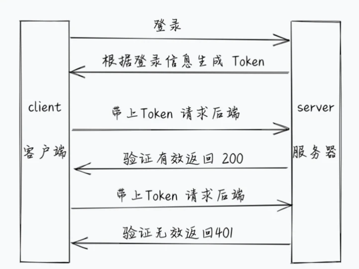
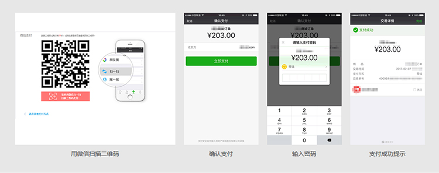
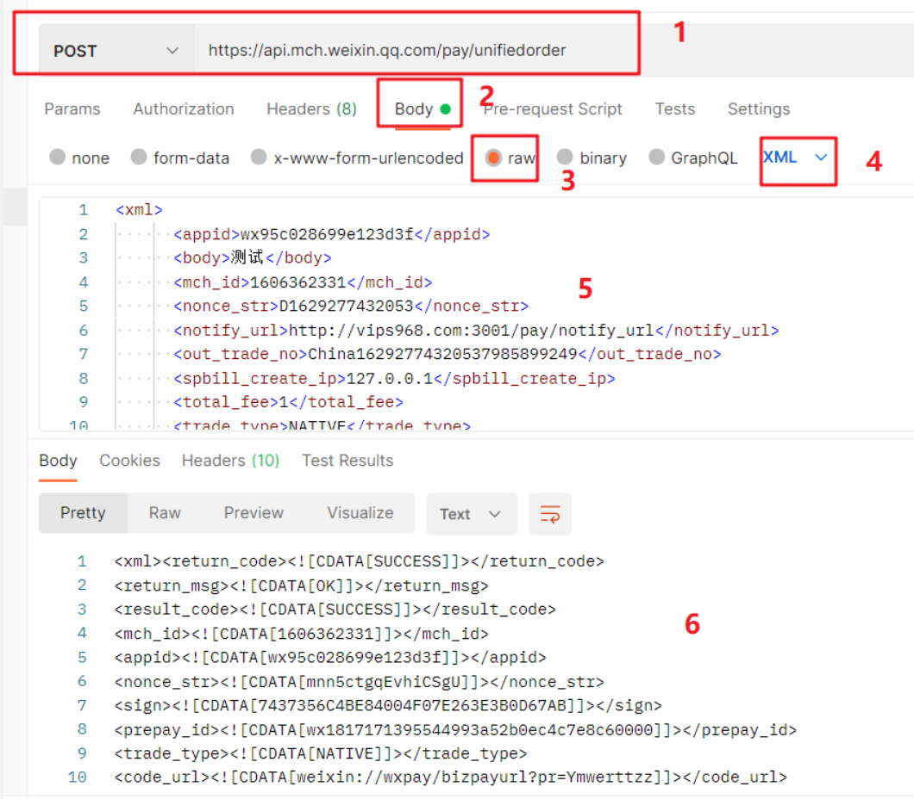

# 乐淘项目

## 0.技术栈

​	后端开发语言：Koa  Koa脚手架搭建项目 ,微信支付，短信验证，JWT，加密

​	数据库:mysql

​	服务器：腾讯云：window server 2012


## 1.项目介绍

### 1.目标

​	后端开发流程：

​	1.后端开发流程，先看设计稿，有多少页面，每个页面需要哪些接口，以及接口功能

​	2.提前思考，先要设计数据库中需要拿到多少个表，表里面需要用到哪些字段，设计数据库中的表

​	3.使用KOA完成接口的开发，自己开发的接口，我们可以使用postman进行接口测试

​	

​	目标：首页用到的接口

### 2.实现

1.乐淘项目有首页，分类页，购物车，会员中心页面

2.首页需要用到的接口：

​	1. banners 接口，提供首页轮播图数据的

​	2. gridList 宫格接口，提供宫格数据

​	3. sportList 运动专区 提供运动专区的数据

​	4.brandList 品牌专区，提供品牌专区的数据

3.分类页用到的接口

​	1.一级分类 oneCategoryList 提供一级分类列表 数据库中需要新建分类表

​	2.二级分类 twoCategoryList  根据id获取二级分类数据


​	

### 3.总结

后端开发，先看设计稿，设计数据库，开发接口，postman测试是否可用，发布测试环境给前端联调

注意：后端开发中，会提前告诉前端开发人数据，接口地址，以及每个接口返回的数据结构，字段，注释，

前端拿到接口地址，接口返回的结构，使用mock等模拟数据，同时进行开发


## 2.项目初始化

### 1.目标

​	koa脚手架安装和使用

### 2.实现

​	1.安装脚手架

```
npm install -g koa-generator
```

​	2.使用koa生成项目

​		1.koa2 项目名称

​	

## 3.koa脚手架项目结构

koa生成器会生成满足koa开发一系列的相关默认配置和文件，我们对初始化的文件目录以及文件掌握


bin				  用于启动服务

public			 公共文件

routes			路由

views			  页面

app.js			  入口文件，初始化koa，加载路由

package.json  记录项目启动方式及包的版本


## 4.核心文件代码

1.app.js 

```js
const Koa = require("koa"); //koa包
const app = new Koa(); //创建koa实例
const views = require("koa-views"); //处理静态资源
const json = require("koa-json"); //json格式化
const onerror = require("koa-onerror"); //处理异常
const bodyparser = require("koa-bodyparser"); //解析post请求
const logger = require("koa-logger"); //记录日志

//加载路由
const index = require("./routes/index");
const users = require("./routes/users");

// error handler  错误处理
onerror(app);

// middlewares 中间件
app.use(
  bodyparser({
    enableTypes: ["json", "form", "text"],
  })
);
app.use(json());
app.use(logger());
app.use(require("koa-static")(__dirname + "/public"));

app.use(
  views(__dirname + "/views", {
    extension: "pug",
  })
);

// logger  日志
app.use(async (ctx, next) => {
  const start = new Date();
  await next();
  const ms = new Date() - start;
  console.log(`${ctx.method} ${ctx.url} - ${ms}ms`);
});

// routes 注册路由
app.use(index.routes(), index.allowedMethods());
app.use(users.routes(), users.allowedMethods());

// error-handling 错误处理 一旦监听到异常，打印异常信息
app.on("error", (err, ctx) => {
  console.error("server error", err, ctx);
});

module.exports = app;

```


2.bin/www 服务启动文件

```js
#!/usr/bin/env node

/**
 * Module dependencies.
 */

var app = require("../app");
var debug = require("debug")("demo:server");
var http = require("http");

/**
 * Get port from environment and store in Express.
 */

var port = normalizePort(process.env.PORT || "3000"); // 服务端口
// app.set('port', port);

/**
 * Create HTTP server.
 */

var server = http.createServer(app.callback()); // 创建服务

/**
 * Listen on provided port, on all network interfaces.
 */

server.listen(port); // 监听端口
server.on("error", onError);
server.on("listening", onListening);

/**
 * Normalize a port into a number, string, or false.
 */

function normalizePort(val) {
  var port = parseInt(val, 10);

  if (isNaN(port)) {
    // named pipe
    return val;
  }

  if (port >= 0) {
    // port number
    return port;
  }

  return false;
}

/**
 * Event listener for HTTP server "error" event.
 */

function onError(error) {
  if (error.syscall !== "listen") {
    throw error;
  }

  var bind = typeof port === "string" ? "Pipe " + port : "Port " + port;

  // handle specific listen errors with friendly messages
  switch (error.code) {
    case "EACCES":
      console.error(bind + " requires elevated privileges");
      process.exit(1);
      break;
    case "EADDRINUSE":
      console.error(bind + " is already in use");
      process.exit(1);
      break;
    default:
      throw error;
  }
}

/**
 * Event listener for HTTP server "listening" event.
 */

function onListening() {
  var addr = server.address();
  var bind = typeof addr === "string" ? "pipe " + addr : "port " + addr.port;
  debug("Listening on " + bind);
}

```


## 5.主从复制，读写分离


# 接口

## 1.首页接口

### 1.1宫格接口开发

1.在路由中 index.js 中新增一个接口名未 gridList 接口

2.在接口 gridList 返回宫格数据

```
//首页宫格数据
router.get("/gridList", async (ctx, next) => {
  ctx.body = {
    status: 200,
    gridList: [
      {
        id: 1,
        img_src: "/images/nav1.png",
      },
      {
        id: 2,
        img_src: "/images/nav2.png",
      },
      {
        id: 3,
        img_src: "/images/nav3.png",
      },
      {
        id: 4,
        img_src: "/images/nav4.png",
      },
    ],
  };
});
```

在routes/index.js  使用router.get('/api的名称',回调),注意：让新增api生效，必须要在app.js 导入


### 1.2MVC设计模式

mvc是一种后端开发常用的设计模式

1. M: model		提供数据
2.  V: view           视图层  使用model提供的数据，呈现页面
3.  C: controller       控制层  禁止model层，进行逻辑业务的编写

优势：低耦合，view层，model层，controller层相互分离，方便维护，降低耦合度


MVVM：是前端非常流行的设计思想，它只是MVC的 view层

M：提供数据

V：模板

VM：模板和数据的桥梁, vue实例化时产生vm

比如

```
const vm = new Vue({
	data:{
		
	},
	methods:{
	
	}
	...
})
```

### 1.3按照MVC架构思想编写服务端代码

使用mvc结构，完成对首页宫格的接口改造


1.需要把 routes/index.js 中gridList 接口拆分

2.用户请求接口时，首先会先进入controller层，在控制model，返回数据给前端调用

3.在controller/index.js 导出一个gridList 控制宫格数据业务逻辑

4.在routes/index.js  导入


在controller/index.js

```
//宫格数据的业务控制
module.exports.gridList = async (ctx, next) => {
  ctx.body = {
    status: 200,
    gridList: [
      {
        id: 1,
        img_src: "/images/nav1.png",
      },
      {
        id: 2,
        img_src: "/images/nav2.png",
      },
      {
        id: 3,
        img_src: "/images/nav3.png",
      },
      {
        id: 4,
        img_src: "/images/nav4.png",
      },
    ],
  };
};
```

routes/index.js

```js
const router = require("koa-router")();
const { gridList } = require("../controller/index");

//首页宫格数据
router.get("/gridList", gridList);

module.exports = router;
```


### 1.4 轮播图、运动专区

1.在routes/index.js 新增两个接口

2.controller/index.js 分别导出

routes/index.js

```
const router = require("koa-router")();
const { gridList, banners, sports } = require("../controller/index");

//首页宫格数据
router.get("/gridList", gridList);

// 轮播图
router.get("/banners", banners);
//运动专区接口
router.get("/sports", sports);

module.exports = router;

```

controller/index.js

```
//宫格数据的业务控制
module.exports.gridList = async (ctx, next) => {
  ctx.body = {
    status: 200,
    data: [
      {
        id: 1,
        img_src: "/images/nav1.png",
      },
      {
        id: 2,
        img_src: "/images/nav2.png",
      },
      {
        id: 3,
        img_src: "/images/nav3.png",
      },
      {
        id: 4,
        img_src: "/images/nav4.png",
      },
    ],
  };
};

//首页轮播图
module.exports.banners = async (ctx, next) => {
  ctx.body = {
    status: 200,
    data: [],
  };
};

//运动专区
module.exports.sports = async (ctx, next) => {
  ctx.body = {
    status: 200,
    data: [
      {
        name: "Nike Air Max 270",
        img: "/images/sport1.png",
        price: 999,
        oldPrice: 1299,
      },
    ],
  };
};
```


### 1.5 一级分类接口用到的表

一级接口，需要用到分类表 category，我们在letao中创建catogory表，然后插入测试数据


创建数据库

```mysql
SHOW DATABASES;

SELECT DATABASE();

use letao;

# --创建分类表
CREATE TABLE `category` (
    `id` int(11) NOT NULL AUTO_INCREMENT,
    `categoryName` varchar(50) DEFAULT null,
    PRIMARY KEY (`id`)
) ENGINE = InnoDB AUTO_INCREMENT = 1 DEFAULT  CHARSET = utf8;
```

插入数据

```mysql
insert into `category` (id, categoryName) values (1,'运动馆'),(2,'女士馆'),(3,'男士馆'),(4,'帆布馆'),(5,'户外馆');
```

补充：查询

```mysql
# 查询所有
select * from 表名;

# 查询指定的列
select 列名1,列名2... from 表名;

# 查询起别名
select 列名1 as 别名,列名2 别名... from 表名;

# 条件查询
select * from 表名 where 条件;
```


### 1.6 连接数据库

koa连接数据库，先下载MySql

1.下载 mysql 包

```
yarn add mysql
```

2.koa连接mysql


3.测试数据库连接

db/query.js

```mysql
var mysql = require("mysql");
var pool = mysql.createPool({
  connectionLimit: 10, //最大连接数
  host: "主机",
  user: "账号",
  password: "密码",
  database: "数据库",
});

//创建连接
pool.getConnection(function (err, connection) {
  if (err) throw err; // not connected!

  // Use the connection 使用连接 发送 sql 语句到数据库mysql  中的 letao 数据库
  //执行结果，在回调函数中参数二返回
  connection.query("SELECT 1 + 1 as 结果", function (error, results, fields) {
    // When done with the connection, release it.  连接上拿到数据后，将当前连接释放回连接池
    connection.release();

    // Handle error after the release.  抛出异常
    if (error) throw error;

    console.log("results", results);

    // Don't use the connection here, it has been returned to the pool.
  });
});
```


### 1.7 封装查询方法 

db/query.js

```js
//创建连接 sql:sql语句
module.exports.query = (sql) => {
  return new Promise((resolve, reject) => {
    pool.getConnection(function (err, connection) {
      if (err) throw err; // not connected!

      // Use the connection 使用连接 发送 sql 语句到数据库mysql  中的 letao 数据库
      //执行结果，在回调函数中参数二返回
      connection.query(sql, function (error, results, fields) {
        // When done with the connection, release it.  连接上拿到数据后，将当前连接释放回连接池
        connection.release();

        // Handle error after the release.  抛出异常
        if (error) throw error;

        resolve(results);
        // Don't use the connection here, it has been returned to the pool.
      });
    });
  });
};
```


## 2.分类页

1.创建 routes/category.js

2.编写一级分类的接口

3.调用该接口时，需要返回一级分类的数据

app.js 注册

```
const category = require("./routes/category");
app.use(category.routes(), category.allowedMethods());
```


routes/category.js

```
const router = require("koa-router")();
const { query } = require("../db/query.js");

// 一级分类接口
router.get("/oneCategory", async (ctx) => {
  const res = await query("select * from category");

  ctx.body = {
    status: 200,
    data: res,
  };
});

module.exports = router;
```


## 3.注册登录功能

### 3.1 用户表

 创建user表

```javascript
-- letao.`user` definition  用户表

CREATE TABLE `user` (
  `id` int(11) NOT NULL AUTO_INCREMENT,
  `username` varchar(50) DEFAULT NULL, 
  `password` varchar(100) DEFAULT NULL,
  `mobile` char(11) DEFAULT NULL,
  `smscode` varchar(100) DEFAULT NULL,
  PRIMARY KEY (`id`)
) ENGINE=InnoDB AUTO_INCREMENT=1 DEFAULT CHARSET=utf8;
```

### 3.2 用户注册

#### 1.思路

1. 按照MVC结构创建users.js
2. 在routes/users.js 定义注册路由

3. app.js 中注册路由


#### 2.代码

​	model/users.js

```
const { query } = require('../db/query');

// 注册
module.exports.register = async (username, password, mobile) => {
    return await query(`insert into user (username, password, mobile) values( "${username}", "${password}", "${mobile}")`);
}
```


controller/users.js

```
const { register } = require('../model/users');

module.exports.register = async (ctx) => {
     const { username, password, mobile } = ctx.request.body;
     await register(username, password, mobile);
     ctx.body = {
         status:200,
         msg:'注册成功'
     }
}
```


routes目录下user.js

```
const router = require('koa-router')();
const { register} = require('../controller/users');

// 用户注册
router.post('/register', register);

module.exports = router;
```


app.js

```
const users = require('./routes/users')

app.use(users.routes(), users.allowedMethods())
```


### 3.3 joi表单数据校验

joi文档地址：https://www.npmjs.com/package/joi

手机号校验正则地址：https://learnku.com/articles/31543

调用注册接口，如果请求参数数据不合法，我们不能进行注册，要提示用户参数不合法，即使前端做参数校验，后端也要做校验，万一用户使用postman等

工具调用接口时，此时前端校验作废，所有后端需要做参数校验。

joi库是专门用于服务端开发参数校验库，使用前需要使用yarn add joi 安装， 在使用时参照官方文档使用

#### 1.思路

1. 服务端使用推荐使用joi在controller层进行参数校验

   1. 安装Joi   

   ```
   yarn add joi
   ```

   

2. 在注册之前使用Joi库进行请求参数校验，通过继续下一步，否则返回异常信息，return 终止后续代码执行


#### 2.代码

```
const { register } = require('../model/users');
const Joi = require('joi');
module.exports.register = async (ctx) => {
     const { username, password, mobile } = ctx.request.body;
        // 校验用户名  密码 手机号
     const schema = Joi.object({
         username:Joi.string().min(3).max(20).required(),
         password:Joi.string().pattern(/^[a-zA-Z0-9]{3,20}$/),
         repeat_password:Joi.ref('password'),
         //手机号正则  
         mobile:Joi.string().pattern(/^1(3\d|4[5-9]|5[0-35-9]|6[2567]|7[0-8]|8\d|9[0-35-9])\d{8}$/)
     })

     // 校验结果对象
     const result = schema.validate({username,password,mobile});
     if (result.error) {
         ctx.body = {
             status:false,
             msg:result.error.details[0].message
         }
         return;
     }
    
     await register(username, password, mobile);
     ctx.body = {
         status:200,
         msg:'注册成功'
     }
}
```


### 3.4 用户是否已注册

用户在注册时，调用注册接口，后端需要判断该用户是否已注册

如果已注册，则提示用户已注册。否则，允许注册


#### 1.思路

1.根据用户名查询数据库中用户表是否存在该用户，是-->返回提示信息，否-->校验参数--> 存入数据库

2.在model层，新建 findUserByUserName 方法，负责查询用户

3.在controller，已注册-->返回提示信息， 否--> 校验参数 --> 存入数据库


#### 2.代码

   1.model/users.js

```javascript
// 根据用户名查询用户
module.exports.findUserByUserName = async (username) => {
  return await query({
    sql: "select * from `user` where `username` = ?",
    values: [username],
  });
};
```

2. controllers/users.js

```
const { register, findUserByUserName } = require("../model/users");
const Joi = require("joi");

module.exports.register = async (ctx) => {
  const { username, password, mobile } = ctx.request.body;
  // 校验用户名  密码 手机号
  const schema = Joi.object({
    username: Joi.string().min(3).max(20).required(),
    password: Joi.string().pattern(/^[a-zA-Z0-9]{3,20}$/),
    repeat_password: Joi.ref("password"),
    //手机号正则
    mobile: Joi.string().pattern(
      /^1(3\d|4[5-9]|5[0-35-9]|6[2567]|7[0-8]|8\d|9[0-35-9])\d{8}$/
    ),
  });

  // 校验结果对象
  const result = schema.validate({ username, password, mobile });
  if (result.error) {
    ctx.body = {
      status: false,
      msg: result.error.details[0].message,
    };
    return;
  }

  //查询当前用户是否已注册
  const user = await findUserByUserName(username);

  //已注册
  if (user[0]) {
    ctx.body = {
      status: 0,
      msg: "用户名已存在",
    };
    return;
  }

  await register(username, password, mobile);
  ctx.body = {
    status: 200,
    msg: "注册成功",
  };
};
```


### 3.5 用户注册加密

文档地址：https://nodejs.org/dist/latest-v14.x/docs/api/crypto.html

用户注册后，为了保护用户信息，需要对用户注册时密码拼接字符串进行加密，加密可以使用node中crypto模块实现


#### 1.思路

1.  根目录创建utils/index.js，封装方法完成用户密码的加密
2.  根目录创建config/index.js 导出加密字符串
3.  在controllers/users.js 注册时调用加密方法传入用户密码和字符串拼接作为参数，返回加密后的密文存储到数据库


#### 2.代码

utils/index.js

```
const crypto = require("crypto");

/**
 *  对用户注册成功后的密码进行MD5加密生成密文后返回
 *  @param {string} pwd 用户注册的密码 拼接 一个随机字符串 后的字符串
 *  @return {string} 返回加密后的密文
 */
module.exports.cryptoPwd = (pwd) => {
  return crypto.createHash("MD5").update(pwd).digest("hex");
};
```

config/index.js

```
// 用于密码机密字符串
module.exports.secret = "letaoSecret";
```

controllers/users.js

```
const { register, findUserByUserName } = require("../model/users");
const { cryptoPwd } = require("../utils");
const { secret } = require("../config");
const Joi = require("joi");

module.exports.register = async (ctx) => {
  const { username, password, mobile } = ctx.request.body;
  // 校验用户名  密码 手机号
  const schema = Joi.object({
    username: Joi.string().min(3).max(20).required(),
    password: Joi.string().pattern(/^[a-zA-Z0-9]{3,20}$/),
    repeat_password: Joi.ref("password"),
    //手机号正则
    mobile: Joi.string().pattern(
      /^1(3\d|4[5-9]|5[0-35-9]|6[2567]|7[0-8]|8\d|9[0-35-9])\d{8}$/
    ),
  });

  // 校验结果对象
  const result = schema.validate({ username, password, mobile });
  if (result.error) {
    ctx.body = {
      status: false,
      msg: result.error.details[0].message,
    };
    return;
  }

  //查询当前用户是否已注册
  const user = await findUserByUserName(username);

  //已注册
  if (user[0]) {
    ctx.body = {
      status: 0,
      msg: "用户名已存在",
    };
    return;
  }

  await register(username, cryptoPwd(password + secret), mobile);
  ctx.body = {
    status: 200,
    msg: "注册成功",
  };
};
```


### 3.6 用户登录

用户注册时，由于进行了加密，所以用户表里该用户的密码是加密之后的，用户在登录时，需要拿到用户密码在一次加密后进行比对，是否一致


#### 1.思路

1.在 controller/users.js 写一个登录方法login 拿到请求参数，用户信息

2.在model/users.js 查询数据库当前用户信息是否存在

3.根据查询结果来决定是否登录成功


#### 2.代码

controller/users.js

```
// 登录
module.exports.login = async (ctx) => {
  const { username, password } = ctx.request.body;

  // 查询用户信息
  const user = await findUserInfo(username, cryptoPwd(password + secret));

  if (user[0]) {
    ctx.body = {
      status: 200,
      msg: "登录成功",
    };
  } else {
    ctx.body = {
      status: 0,
      msg: "登录失败，用户名或密码错误",
    };
  }
};
```


model/users.js

```
module.exports.findUserInfo = async (username, password) => {
  return await query({
    sql: "select * from `user` where `username` = ? and `password` = ?",
    values: [username, password],
  });
};
```


routes/users.js

```
router.post("/login", login);
```


### 3.7 短信验证

#### 1.短信验证作用

-  验证用户身份，保证用户填写的手机号码的真实性
-  减少非法注册和恶意注册，提高会员注册质量
-  提高网站用户注册的质量，更有效地管理注册用户，随时保持联系和沟通

#### 2.安装SDK

```javascript
yarn add tencentcloud-sdk-nodejs
```

#### 3.短信验证代码

​     utils目录下utils.js

    // 生成指定范围的随机整数
     module.exports.getRandom = (min, max) => {
         return Math.floor(Math.random() * (max - min) + 1);
     }
     
     // 短信验证码
     module.exports.smscode = (codeLen) => {
         let code = '';
         for (let i = 0; i < codeLen; i++) {
             code += this.getRandom(0, 9);
         }
         return code;
     }
     
     // 发送短信功能
     module.exports.sendSms = async (mobile, code) => {
         const tencentcloud = require("tencentcloud-sdk-nodejs")
         // 导入对应产品模块的client models。
         const smsClient = tencentcloud.sms.v20210111.Client
         /* 实例化要请求产品(以sms为例)的client对象 */
         const client = new smsClient({
             credential: {
                 /* 必填：腾讯云账户密钥对secretId，secretKey。
                  * 这里采用的是从环境变量读取的方式，需要在环境变量中先设置这两个值。
                  * 你也可以直接在代码中写死密钥对，但是小心不要将代码复制、上传或者分享给他人，
                  * 以免泄露密钥对危及你的财产安全。
                  * CAM密匙查询: https://console.cloud.tencent.com/cam/capi */
                 secretId: process.env.secretId,
                 secretKey: process.env.secretKey,
             },
             /* 必填：地域信息，可以直接填写字符串ap-guangzhou，或者引用预设的常量 */
             region: "ap-guangzhou",
             /* 非必填:
              * 客户端配置对象，可以指定超时时间等配置 */
             profile: {
                 /* SDK默认用TC3-HMAC-SHA256进行签名，非必要请不要修改这个字段 */
                 signMethod: "HmacSHA256",
                 httpProfile: {
                     /* SDK默认使用POST方法。
                      * 如果你一定要使用GET方法，可以在这里设置。GET方法无法处理一些较大的请求 */
                     reqMethod: "POST",
                     /* SDK有默认的超时时间，非必要请不要进行调整
                      * 如有需要请在代码中查阅以获取最新的默认值 */
                     reqTimeout: 30,
                     /**
                      * SDK会自动指定域名。通常是不需要特地指定域名的，但是如果你访问的是金融区的服务
                      * 则必须手动指定域名，例如sms的上海金融区域名： sms.ap-shanghai-fsi.tencentcloudapi.com
                      */
                     endpoint: "sms.tencentcloudapi.com"
                 },
             },
         })
         /* 请求参数，根据调用的接口和实际情况，可以进一步设置请求参数
         * 属性可能是基本类型，也可能引用了另一个数据结构
         * 推荐使用IDE进行开发，可以方便的跳转查阅各个接口和数据结构的文档说明 */
         const params = {
             /* 短信应用ID: 短信SmsSdkAppId在 [短信控制台] 添加应用后生成的实际SmsSdkAppId，示例如1400006666 */
             SmsSdkAppId: process.env.SmsSdkAppId,
             /* 短信签名内容: 使用 UTF-8 编码，必须填写已审核通过的签名，签名信息可登录 [短信控制台] 查看 */
             SignName: process.env.SignName,
             /* 短信码号扩展号: 默认未开通，如需开通请联系 [sms helper] */
             ExtendCode: "",
             /* 国际/港澳台短信 senderid: 国内短信填空，默认未开通，如需开通请联系 [sms helper] */
             SenderId: "",
             /* 用户的 session 内容: 可以携带用户侧 ID 等上下文信息，server 会原样返回 */
             SessionContext: "",
             /* 下发手机号码，采用 e.164 标准，+[国家或地区码][手机号]
              * 示例如：+8613711112222， 其中前面有一个+号 ，86为国家码，13711112222为手机号，最多不要超过200个手机号*/
             PhoneNumberSet: [`+86${mobile}`],
             /* 模板 ID: 必须填写已审核通过的模板 ID。模板ID可登录 [短信控制台] 查看 */
             TemplateId: process.env.TemplateId,
             /* 模板参数: 若无模板参数，则设置为空*/
             TemplateParamSet: [code],
         }
         // 通过client对象调用想要访问的接口，需要传入请求对象以及响应回调函数
         return await client.SendSms(params);
     }


​      controller目录下sms.js

```javascript
const { smscode, sendSms } = require('../utils/utils');
// 短信验证
module.exports.sms = async (ctx) => {
    // 请求参数手机号
    const { mobile } = ctx.request.body;
    // 短信验证码随机数 4位数字 
    const code = smscode(4);
    const data = await sendSms(mobile, code)
    // 发送失败
    if (data.SendStatusSet[0].Code != 'Ok') {
        ctx.body = {
            status: 1040,
            msg:data.SendStatusSet[0].Message
        }
        return;
    }
    ctx.body = {
        status:200,
        code,
        msg:'短信发送成功'
    }
    
}
```

短信服务开通后，按照官方提供sdk，代码复制粘贴，相关信息，我们要使用 env node环境变量做配置


### 3.8 JWT

#### 1.什么是身份验证

​      日常生活中的**身份验证**的场景:  比如进入公司的大楼时，需要携带工牌；打卡上班时，需要指纹识别；打开工作电脑时，需要输入密码。

#### 2. 什么是 JSON 网络令牌？

JSON Web Token (JWT) 是一个开放标准 ( [RFC 7519](https://tools.ietf.org/html/rfc7519) )，用于在各方之间作为 JSON 对象安全地传输信息。就是通过用户名和密码来生成token确认用户的身份，确认过身份的用户称为为**授权用户(Authenticated user)**。

全称 `JSON Web Token`， 是目前最流行的跨域认证解决方案。基本的实现是服务端认证后，生成一个 `JSON` 对象，发回给用户。用户与服务端通信的时候，都要在请求头带上这个 `JSON` 对象

#### 3.  JSON 网络令牌的作用

- **授权**：这是使用 JWT 最常见的场景。用户登录后，每个后续请求都将包含 JWT，允许用户访问该令牌允许的路由、服务和资源。

#### 4. JSON Web Token 结构

在其紧凑形式中，JSON Web Tokens 由用点 ( `.`)分隔的三个部分组成，它们是：

- 标题

  ```javascript
  {"alg":"HS256","typ":"JWT"}
  ```

- 有效载荷

  - ```javascript
    {"username":"letao","password":"123456","iat":1634524068,"exp":1634527668}
    ```

  - 

- 签名

  

因此，JWT 通常如下所示。

```
xxxxx.yyyyy.zzzzz
```


 JWT格式: 


#### 5.JSON 网络令牌如何工作？

在身份验证中，当用户使用其凭据成功登录时，将返回 JSON Web Token。由于令牌是凭证，因此必须非常小心以防止出现安全问题。通常，您不应将令牌保留的时间超过所需的时间。

每当用户想要访问受保护的路由或资源时，用户代理应该发送 JWT，通常在使用**Bearer**模式的**Authorization**标头中。标题的内容应如下所示：

```
Authorization: Bearer <token>
```





#### 6.代码

  文档地址： https://www.npmjs.com/package/jsonwebtoken

   1. 安装```jsonwebtoken``` 

      ```javascript
      yarn add jsonwebtoken
      ```

​     2.controller目录user.js

1. 登录成功之后使用jsonwebtoken根据用户名和密码生成token返回

```javascript
const userModel = require('../model/user');
const { validator, cryptoPwd } = require('../utils/utils');
const { config:{encrypStr , secret} } = require('../config/config');
const jwt = require('jsonwebtoken');

// 用户登录
module.exports.login = async (ctx) => {
    // 1. 获取登录信息
    const { username, password } = ctx.request.body;
    let msg = validator.checkUserName(username) || validator.checkPassword(password)
    if (msg) {
        ctx.body = {
            msg,
            status: 1010
        }
    }
    // 2. 登录
    const result = await userModel.login(username, cryptoPwd(password + encrypStr));


    const token =  await jwt.sign({
        username,
        password
    }, secret, { expiresIn: 36 * 60 * 60 }); // 
    if (result[0]) {
        ctx.body = {
            status: 200,
            token,
            msg: '登录成功'
        }
    } else {
        ctx.body = {
            status: 1040,
            msg: '登录失败'
        };
    }

}
```

   3. 验证JSON Web 令牌的 Koa 中间件

      文档地址：https://www.npmjs.com/package/koa-jwt

   4. 安装koa-jwt

      ```javascript
      yarn add koa-jwt
      ```

   5. app.js

      ```javascript
      const Koa = require('koa') // 引入KOA
      const app = new Koa() // 创建KOA应用实例
      const views = require('koa-views') // 处理动态模板
      const json = require('koa-json')  // 格式化输出的json
      const onerror = require('koa-onerror') // 捕获异常
      const bodyparser = require('koa-bodyparser') // 处理post请求
      const logger = require('koa-logger') // 日志记录
      const dotenv = require('dotenv');
      var xmlParser = require('koa-xml-body');
      var jwt = require('koa-jwt');
      const {config:{secret}} = require('./config/config');
      
      // 启动Node env环境
      dotenv.config();
      
      // 加载路由
      const order = require('./routes/order')
      const user = require('./routes/user')
      
      // error handler  错误处理
      onerror(app)
      
      app.use(xmlParser());
      
      // middlewares  使用中间件
      app.use(function(ctx, next){
        return next().catch((err) => {
          if (401 == err.status) {
            ctx.status = 401;
            ctx.body = 'Protected resource, use Authorization header to get access\n';
          } else {
            throw err;
          }
        });
      });
      app.use(jwt({ secret }).unless({ path: [/^\/public/, /^\/login/]}))
      app.use(bodyparser({
        enableTypes: ['json', 'form', 'text']
      }))
      app.use(json())
      app.use(logger())
      app.use(require('koa-static')(__dirname + '/public'))
      
      // 动态文件模板处理
      app.use(views(__dirname + '/views', {
        extension: 'pug'
      }))
      
      // logger 日志输出
      app.use(async (ctx, next) => {
        const start = new Date()
        await next()
        const ms = new Date() - start
        console.log(`${ctx.method} ${ctx.url} - ${ms}ms`)
      })
      
      // routes 注册路由
      app.use(order.routes(), order.allowedMethods())
      app.use(user.routes(), user.allowedMethods())
      
      // error-handling  错误处理
      app.on('error', (err, ctx) => {
        console.error('server error', err, ctx)
      });
      
      module.exports = app
      
      ```


## 4. 微信支付

- 文档地址：https://pay.weixin.qq.com/wiki/doc/api/index.html
- 扫码支付是指商户系统按微信支付协议生成支付二维码，用户再用微信“扫一扫”来完成支付。



### 4.1 申请流程

#### 4.1.1 注册公众号

请根据营业执照类型选择以下主体注册：

- [个体工商户](http://kf.qq.com/faq/120911VrYVrA151009JB3i2Q.html)
- [企业/公司](http://kf.qq.com/faq/120911VrYVrA151013MfYvYV.html)
- [政府](http://kf.qq.com/faq/120911VrYVrA15100973ABZz.html)
- [媒体](http://kf.qq.com/faq/120911VrYVrA151013aMNfeQ.html)
- [其他组织](http://kf.qq.com/faq/120911VrYVrA151013nYFZ7Z.html)

#### 4.1.2 认证公众号

公众号认证后才可申请微信支付，认证费：300元/次 查看[认证流程](http://kf.qq.com/product/weixinmp.html#hid=97)

#### 4.1.3 提交资料申请微信支付

登录公众平台，点击左侧菜单【微信支付】，开始填写资料等待审核，审核时间为48小时内。

#### 4.1.4 开户成功，进行账户验证

资料审核通过后，开户信息会通过邮件、公众号发送给联系人，请按照指引填写财付通备付金汇入的随机金额，完成账户验证。（查看验证方法）

#### 4.1.5 在线签署协议

本协议为线上电子协议，签署后方可进行交易及资金结算，签署完立即生效。点此提前预览协议内容。

#### 4.1.6 启动设计和开发

支付接口已获得，可根据[开发文档](https://pay.weixin.qq.com/wiki/doc/api/index.html)进行开发，也可了解成功案例界面示意及素材。

#### 4.1.7 准备素材

- [扫码支付](https://pay.weixin.qq.com/wiki/doc/api/native.php?chapter=6_1)
- APPID [公众平台](https://mp.weixin.qq.com/)(1959583119)->右上角->开发者ID->AppID
- 商户号码和配置回调链接 [商户平台](https://pay.weixin.qq.com/)->产品中心->开发配置->商户信息->商户号
- 配置APPID [商户平台](https://pay.weixin.qq.com/)->产品中心->APPID授权管理
- API密钥 [商户平台](https://pay.weixin.qq.com/)->账户中心->API安全->设置API密钥

### 4.2 接入流程

- 商户后台系统先调用微信支付的统一下单接口

- ### 微信后台系统返回链接参数code_url

- 商户后台系统将code_url值生成二维码图片

- 用户使用微信客户端扫码后发起支付

- 注意：code_url有效期为2小时，过期后扫码不能再发起支付。


业务流程说明：

- 1）商户后台系统根据用户选购的商品生成订单。
- 2）用户确认支付后调用微信支付[统一下单API](https://pay.weixin.qq.com/wiki/doc/api/native.php?chapter=9_1)生成预支付交易；
- 3）微信支付系统收到请求后生成预支付交易单，并返回交易会话的二维码链接code_url。
- 4）商户后台系统根据返回的code_url生成二维码。
- 5）用户打开微信“扫一扫”扫描二维码，微信客户端将扫码内容发送到微信支付系统。
- 6）微信支付系统收到客户端请求，验证链接有效性后发起用户支付，要求用户授权。
- 7）用户在微信客户端输入密码，确认支付后，微信客户端提交授权。
- 8）微信支付系统根据用户授权完成支付交易。
- 9）微信支付系统完成支付交易后给微信客户端返回交易结果，并将交易结果通过短信、微信消息提示用户。微信客户端展示支付交易结果页面。
- 10）微信支付系统通过发送异步消息通知商户后台系统支付结果。商户后台系统需回复接收情况，通知微信后台系统不再发送该单的支付通知。
- 11）未收到支付通知的情况，商户后台系统调用[查询订单API](https://pay.weixin.qq.com/wiki/doc/api/native.php?chapter=9_2)
- 12）商户确认订单已支付后给用户发货。

### 4.3.沙箱测试

#### 4.3.1 文档地址：

​          http://mp.weixin.qq.com/debug/cgi-bin/sandboxinfo?action=showinfo&t=sandbox/index

#### 4.3.2 测试号：

```javascript
 appId: 'wx045745a074f22a9f', // 测试环境
 appSecret: 'a3b77cbd62e67197bda0482a4d266106'   // 秘钥
```

#### 4.3.3正式环境

```javascript
appid： 	自己的apppid
mch_id：自己的商户id(需要个体户或者公司注册才可以有)
key：   自己的key
```

### 4.4.微信支付实现流程（native扫码支付）

       1. 调用下单接口拿到支付二维码
       2. 扫码付款成功之后会回调接口（必须部署在服务器上外网可以访问），完成订单存储到mysql
       3. 调用微信订单查询接口,查询用户支付状态

####  一：微信Native下单

​         文档地址：https://pay.weixin.qq.com/wiki/doc/api/index.html

​         postman测试接口:

​	     请求参数:

      <xml>
            <appid>wx95c028699e123d3f</appid>
            <body>测试</body>
            <mch_id>1606362331</mch_id>
            <nonce_str>D1629277432053</nonce_str>
            <notify_url>http://vips968.com:3001/pay/notify_url</notify_url>
            <out_trade_no>China16292774320537985899249</out_trade_no>
            <spbill_create_ip>127.0.0.1</spbill_create_ip>
            <total_fee>1</total_fee>
            <trade_type>NATIVE</trade_type>
            <sign>812D86C45234CD6A189B881C24B41449</sign>
      </xml>

​       返回数据:

``` xml
<xml>
    <return_code><![CDATA[SUCCESS]]></return_code>
    <return_msg><![CDATA[OK]]></return_msg>
    <result_code><![CDATA[SUCCESS]]></result_code>
    <mch_id><![CDATA[1606362331]]></mch_id>
    <appid><![CDATA[wx95c028699e123d3f]]></appid>
    <nonce_str><![CDATA[3SQGZ6hZHKDePZu5]]></nonce_str>
    <sign><![CDATA[D3B5906A6205E4BFF01CEFCB30620F4F]]></sign>
    <prepay_id><![CDATA[wx18171217836292e6955c892133450b0000]]></prepay_id>
    <trade_type><![CDATA[NATIVE]]></trade_type>
    <code_url><![CDATA[weixin://wxpay/bizpayurl?pr=eg3n2ttzz]]></code_url>
</xml>
```

​       postman测试



订单表order

```sql
CREATE TABLE `payorder` (
  `id` int(11) NOT NULL AUTO_INCREMENT,
  `appid` varchar(50) NOT NULL,
  `bank_type` varchar(50) NOT NULL,
  `cash_fee` varchar(50) NOT NULL,
  `fee_type` varchar(50) NOT NULL,
  `is_subscribe` varchar(50) NOT NULL,
  `mch_id` varchar(50) NOT NULL,
  `nonce_str` varchar(50) NOT NULL,
  `openid` varchar(50) NOT NULL,
  `out_trade_no` varchar(50) NOT NULL,
  `sign`varchar(50) NOT NULL,
  `time_end` varchar(50) NOT NULL,
  `total_fee` varchar(50) NOT NULL,
  `trade_type`  varchar(50) NOT NULL,
  `transaction_id` varchar(50) NOT NULL,
   PRIMARY KEY (`id`)
)
```

#####       1. controller目录下新建order.js

```javascript
const { payconfig: { wx: { appid, mchid } } } = require('../config/payConfig');
const { getOrderNo, getRandomStr, createSign, createOrder, getOrder } = require('../utils/utils');
const { config: { wx_notify_url, orderUrl, queryOrderUrl } } = require('../config/config');
const QRCode = require('qrcode');
let flag = false;
const commonParams = {
    // 随机字符串
    nonce_str: getRandomStr(),
    // 随机订单号
    out_trade_no: getOrderNo()
}

// 微信下单
module.exports.order = async (ctx) => {
    const { body, ip, total_fee, trade_type } = ctx.request.body;
    // // 随机字符串
    // const nonce_str = getRandomStr();
    // // 随机订单号
    // const out_trade_no = getOrderNo();
    const { nonce_str, out_trade_no } = commonParams;
    // 生成签名请求的参数
    let params = {
        appid,
        body,
        mch_id: mchid,
        nonce_str,
        notify_url: wx_notify_url,
        out_trade_no,
        spbill_create_ip: ip,
        total_fee,
        trade_type,
    }
    // 生成签名
    let sign = createSign(params);
    // 请求参数
    let sendData = `<xml>
      <appid>${appid}</appid>
      <body>${body}</body>
      <mch_id>${mchid}</mch_id>
      <nonce_str>${nonce_str}</nonce_str>
      <notify_url>${wx_notify_url}</notify_url>
      <out_trade_no>${out_trade_no}</out_trade_no>
      <spbill_create_ip>${ip}</spbill_create_ip>
      <total_fee>${total_fee}</total_fee>
      <trade_type>${trade_type}</trade_type>
      <sign>${sign}</sign>
   </xml>`;
    console.log(sendData, 'sendData');

    try {
        // 微信下单
        const data = await createOrder(orderUrl, sendData);
        const payUrl = await QRCode.toDataURL(data.code_url[0]);
        data.payUrl = payUrl;
        // 根据微信下单二维码创建支付二维码
        ctx.body = {
            status: 200,
            data
        }
    } catch (error) {
        // 如果已经支付
        console.log('err', error);
        ctx.body = {
            status:1050,
            data:error.xml.err_code_des[0]
        }

        
    }


}
```

​      工具类utils.js

```javascript
const { payconfig: { wx: { key } } } = require('../config/payConfig');
const axios = require('axios');
const crypto = require('crypto');
const xml = require('xml2js');
const validator = require('validator');

// 生成交易单号
module.exports.getOrderNo = () => {
    // 日期时间戳字符串
    const date = new Date().getTime().toString();
    const str = '0123456789';
    // 随机字符串
    let text = '';
    for (let i = 0; i < 10; i++) {
        text += str[str[this.getRandom(0, 9)]];
    }
    console.log(text, 'text');
    // 返回32位以内的随机字符串
    return 'China' + date + text;
}
// 生成随机字符串
module.exports.getRandomStr = () => {
    return 'D' + new Date().getTime();
}

// 生成签名
module.exports.createSign = (args) => {
    // 对参数按照key=value的格式，并按照参数ASCII字典排序
    let sortedParams = ''
    Object.keys(args).sort().forEach((key) => {
        sortedParams += `${key}=${args[key]}&`;
    });
    sortedParams += `key=${key}`;
    console.log(sortedParams, 'sortedParams');
    let sign = crypto.createHash('MD5').update(sortedParams).digest('hex').toUpperCase();
    return sign
}

// 生成指定范围的随机整数
module.exports.getRandom = (min, max) => {
    return Math.floor(Math.random() * (max - min) + 1);
}

// 微信下单
module.exports.createOrder = (url,params) => {
    return new Promise(async (resolve, reject) => {
        // 发送下单请求
        const data = await axios({
            url,
            method: 'POST',
            data:params
        });

        // 解析返回的xml格式
        xml.parseString(data.data, (error, res) => {
            if (res.xml.return_code == 'SUCCESS' && res.xml.return_msg == 'OK' && res.xml.result_code == "SUCCESS") {
                resolve(res.xml)
            } else {
                reject(res);
            }
        });
    })
}

// 查询微信下单的订单
module.exports.getOrder = (url, params) =>{
    return new Promise( async (resolve, reject) =>{
        const data = await axios({
            url,
            method: 'POST',
            data:params
        });

        // 解析返回的xml格式
        xml.parseString(data.data, (error, res) => {
            console.log(res.xml);
            if (res.xml.return_code == 'SUCCESS' && res.xml.return_msg == 'OK' && res.xml.result_code == "SUCCESS") {
                resolve(res.xml)
            } else {
                reject(res);
            }
            
        });

    });
}

```


##### 2：路由设置 新建order.js

```javascript
const router = require('koa-router')();
const { order,notify, queryOrder} = require('../controller/order');


// 微信下单
router.post('/wx/order', order);

module.exports = router;
```

##### 3:app.js

```javascript
// 加载路由
const order = require('./routes/order')
// routes 注册路由
app.use(order.routes(), order.allowedMethods())
```

#### 二： 扫码支付

 要求：

   	1. 部署到服务器上
   	2. 域名需要备案外网可以访问

#####    1.controller目录order.js

```javascript
// 下单后的通知回调
module.exports.notify = async (ctx) => {
    console.log(ctx.request.body.xml, 'ctx.request.body.xml')
 
        const { appid, bank_type,cash_fee,fee_type,is_subscribe,mch_id,nonce_str,openid,out_trade_no,sign,time_end,total_fee,trade_type,transaction_id } = ctx.request.body.xml;
       // 根据订单号查询是否已经创建订单
       const result = await query('select out_trade_no from payorder')
       if (result[0]) return; 
        // 在数据库中保存订单信息
        await query(`insert into payorder(appid, bank_type,cash_fee,fee_type,is_subscribe,mch_id,nonce_str,openid,out_trade_no,sign,time_end,total_fee,trade_type,transaction_id) values('${appid}','${bank_type}','${cash_fee}','${fee_type}','${is_subscribe}','${mch_id}','${nonce_str}','${openid}','${out_trade_no}','${sign}','${time_end}','${total_fee}','${trade_type}','${transaction_id}')`);
    
}
```

##### 2.routes目录 order.js中

```javascript
const router = require('koa-router')();

const { order,notify } = require('../controller/order');

// 微信下单
router.post('/order', order);

// 微信下单后通知
router.post('/pay/notify',notify)

module.exports = router;
```

#### 三: 微信订单查询

 文档地址：https://pay.weixin.qq.com/wiki/doc/api/index.html

#####     1. controller目录下的order.js

```javascript
// 查询微信订单
module.exports.queryOrder = async (ctx) =>{
    // 生成签名
    let sign = createSign({
        appid,
        mch_id,
        nonce_str,
        out_trade_no
    })
    let sendData = `
    <xml>
   <appid>${appid}</appid>
   <mch_id>${mch_id}</mch_id>
   <nonce_str>${nonce_str}</nonce_str>
   <out_trade_no>${out_trade_no}</out_trade_no>
   <sign>${sign}</sign>
   </xml>`;

   const data = await getOrder('https://api.mch.weixin.qq.com/pay/orderquery', sendData);
    ctx.body = {
        status: 200,
        data
    };
}
```

所用的工具类库utils.js

```javascript
// 查询订单
module.exports.getOrder = (url,params) =>{
    return new Promise(async (resolve, reject) => {
        // 发送下单请求
        const data = await axios({
            url,
            method: 'POST',
            data:params
        });
        // 解析返回的xml格式
        xml.parseString(data.data, (error, res) => {
            console.log(res.xml,'res222');
            if (res.xml.return_code == 'SUCCESS' && res.xml.return_msg == 'OK' && res.xml.result_code == "SUCCESS") {
                resolve(res.xml)
            } else {
                reject(res);
            }
        });
    })
}
```

##### 2. routes目录下 order.js

```javascript
const router = require('koa-router')();

const { order,notify,queryOrder } = require('../controller/order');

// 微信下单
router.post('/order', order);

// 微信下单后通知
router.post('/pay/notify',notify);

// 微信查询订单
router.post('/queryOrder',queryOrder)


module.exports = router;
```


### 4.5 订单表

#### 4.5.1 目标： 订单表在什么时候开始写入数据

     1. 我们调用微信下单接口，根据生成code_url使用qrcode生成支付二维码，返给前端，此时订单就产生，只不过是用户还没有支付而已，此时，我们把订单数据写入到数据库 ， 这时订单状态是未支付， 当用户在页面点击下单购买，需要扫描支付二维码，当用户付款成功时， 微信服务器要回调乐淘服务端接口，此时需要把订单支付状态改成已支付。


#### 4.5.2 订单表数据

##### 1.目标

​	  我们在订单生成时，把订单数据存到数据表payorder， 用户支付成功，把payorder订单表中支付状态改成已支付。

##### 2.实现思路

1.   使用utils/index.js 中的query方法 在订单生成后，写入订单数据到payorder


#####  3.代码实现

controller/order.js

```javascript
module.exports.order = async (ctx) => {
    // 前端调用下单接口时传递的参数
    const { body, total_fee, spbill_create_ip, trade_type,nonce_str, out_trade_no} = ctx.request.body;
    // 生成sign需要的参数
    const params = {
        appid,
        mch_id,  // 商户号
        nonce_str, // 32位以内的随机字符串
        // sign, // 签名
        body, // 商品描述
        out_trade_no, // 商户订单号
        total_fee, // 金额
        spbill_create_ip,  // 终端ip
        notify_url, // 微信服务器回调的地址
        trade_type,  // 支付类型
    }
    nonce_str = getRandomStr();// 随机字符串
    // 生产签名  需要你发送的参数生成
    const sign = createSign(params);
    //微信下单请求参数    
    let sendData = `
            <xml>
                <appid>${appid}</appid>
                <body>${body}</body>
                <mch_id>${mch_id}</mch_id>
                <nonce_str>${params.nonce_str}</nonce_str>
                <notify_url>${notify_url}</notify_url>
                <out_trade_no>${params.out_trade_no}</out_trade_no>
                <spbill_create_ip>${spbill_create_ip}</spbill_create_ip>
                <total_fee>${total_fee}</total_fee>
                <trade_type>${trade_type}</trade_type>
                <sign>${sign}</sign>
            </xml>
   `
    const data = await orderHandle(orderUrl, sendData);

    // 下单成功
    const { return_code, return_msg, result_code, code_url } = data;
    if (return_code == 'SUCCESS' && return_msg == 'OK' && result_code == "SUCCESS") {
        // 把订单数据写入到payorder
        await query(`insert into payorder (appid,mch_id,nonce_str,body,out_trade_no,total_fee,spbill_create_ip,trade_type,trade_state) values ("${appid}","${mch_id}","${nonce_str}","${body}","${out_trade_no}","${total_fee}","${spbill_create_ip}","${trade_type}","NOTPAY")`);
        data.payUrl = await QRCode.toDataURL(code_url)
    }

    ctx.body = {
        status: 200,
        data
    }
}
```


##### 4.总结

调用微信下单接口，订单生成时，需要把订单数据吸入，支付成功时，在回调通知接口中，根据商户订单号更新订单状态


### 4.6 商户订单号还有随机字符串

#### 1 目标

   我们目前微信下单时，随机字符串，商户订单号，在服务端生成的，我们遇到一个问题？ 微信下单和订单查询使用参数随机字符串，商户订单号是一致的，导致两个该在何时生成？？？   

#### 2 实现思路

1. 两种方案， 第一种是把随机字符串和商户订单号，在服务端生成，返回给前端。
   1. 为什么要给前端呢？ 	是因为前端需要调用订单查询接口，需要使用微信下单时的随机字符串，商户订单号
2. 第二种，在客户端生成，由客户端传给服务端。

#### 3 代码实现

```javascript
// 微信下单
module.exports.order = async (ctx) => {
    // 前端调用下单接口时传递的参数
    const { body, total_fee, spbill_create_ip, trade_type} = ctx.request.body;
    // 生成sign需要的参数
    const params = {
        appid,
        mch_id,  // 商户号
        nonce_str:getRandomStr(), // 32位以内的随机字符串
        // sign, // 签名
        body, // 商品描述
        out_trade_no:getTrade_no(), // 商户订单号
        total_fee, // 金额
        spbill_create_ip,  // 终端ip
        notify_url, // 微信服务器回调的地址
        trade_type,  // 支付类型
    }
    // 生产签名  需要你发送的参数生成
    const sign = createSign(params);
    //微信下单请求参数    
    let sendData = `
            <xml>
                <appid>${appid}</appid>
                <body>${body}</body>
                <mch_id>${mch_id}</mch_id>
                <nonce_str>${params.nonce_str}</nonce_str>
                <notify_url>${notify_url}</notify_url>
                <out_trade_no>${params.out_trade_no}</out_trade_no>
                <spbill_create_ip>${spbill_create_ip}</spbill_create_ip>
                <total_fee>${total_fee}</total_fee>
                <trade_type>${trade_type}</trade_type>
                <sign>${sign}</sign>
            </xml>
   `
    const data = await orderHandle(orderUrl, sendData);

    // 下单成功
    const { return_code, return_msg, result_code, code_url } = data;
    if (return_code == 'SUCCESS' && return_msg == 'OK' && result_code == "SUCCESS") {
        // 把订单数据写入到payorder
        await query(`insert into payorder (appid,mch_id,nonce_str,body,out_trade_no,total_fee,spbill_create_ip,trade_type,trade_state) values ("${appid}","${mch_id}","${params.nonce_str}","${body}","${params.out_trade_no}","${total_fee}","${spbill_create_ip}","${trade_type}","NOTPAY")`);
        data.payUrl = await QRCode.toDataURL(code_url)
        // 把随机字符串 和商户订单号传给前端
        data.nonce_str = params.nonce_str;
        data.out_trade_no = params.out_trade_no;
    }

    ctx.body = {
        status: 200,
        data
    }
}
```

#### 4 总结

​     随机字符串，商户订单，在微信下单时传给前端，目的是，前端调订单查询时，需要这个参数，而且参数值必须一样？？ 订单生成时候用的参数值什么？查询的时候也要保持一直才行。


### 4.7 订单表的设计

#### 1.目标

​    微信下单后的数据，把需要的字段写入的订单表中

#### 2.实现思路

​	1.创建订单表潘payorder

​    2.调用微信下单接口时，必须的请求，当成订单数据写入payorder

#### 3.代码实现

```mysql
create table payorder (
    `id` int NOT NULL auto_increment PRIMARY KEY,
	`appid` varchar(50) NOT NULL,
    `mch_id` varchar(50) NOT NULL,
    `nonce_str` varchar(50) NOT NULL,
    `body` varchar(100) NOT NULL,
    `out_trade_no` varchar(50) NOT NULL,
    `total_fee` varchar(50) NOT NULL,
    `spbill_create_ip` varchar(50) NOT NULL,
    `trade_type` varchar(20) NOT NULL,
    `trade_state` varchar(20) NOT null
);
```

#### 4.总结

数据表的创建，sql语法不区分大小写，推荐统一大写,

create  table 表名 （

  `字段` 数据类型

）

### 4.8 微信下单到支付流程

#### 1.目标

 我们要走通微信下单到支付的流程，我们需要服务端的代码部署服务器， 目标：搞明白整个流程和相关注意事项

#### 2.实现思路

1.   把本地代码复制粘贴到window 服务器
2.   在window服务器上根据package.json 下载安装包
3.   在服务端启动后端项目， postman测试流程

#### 3.总结

   1. 使用query操作sql时， 

      update  `update 表名  set 列表 = 值  where 列名 = “${值}”`

      select  query(` `select * from 表名  where 列名 = ？， [值])

      insert into 表名  (列名...)  values ("${值}")

        2. 回调地址配置一定给服务端的接口地址对应起来

        3. 我们把订单数据在下单时就写入payorder， 在支付通知时只需要更改订单支付状态，无需支付回调查询订单表。


参考资料： 

1. 签名算法 https://pay.weixin.qq.com/wiki/doc/api/native.php?chapter=4_3
2. xml2js： https://www.npmjs.com/package/xml2js
3. qrcode:https://www.npmjs.com/package/qrcode
4. koa-xml-body: https://www.npmjs.com/package/koa-xml-body

