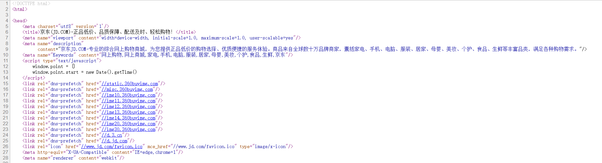
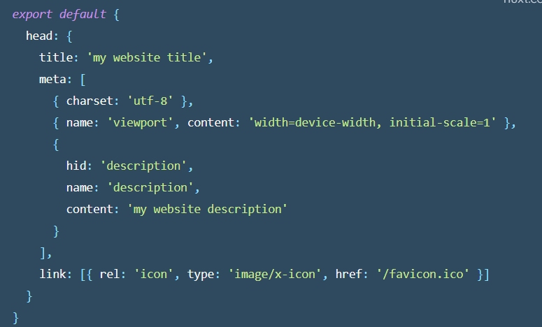

## 01.HTML头部

### 1.设置全局头信息

每个页面都有head头信息，比如京东首页头部信息

### 2.设置页面头信息

​    在Nuxt中,我们可以在nuxt.config.js 这个配置文件中统一设置所有页面的头信息

.

#### 1.设置方式

- 全局设置（为所有页面设置同样的head信息）   -->在nuxt.config.js中设置
- 页面设置：  在页面中使用head()来设置每个页面的头信息
  - 在设置头信息时添加hid可以覆盖全局的同名的标签
- 除了设置每个页面的头信息之外，还可以用来加载JS,CSS等外部的文件

#### 2.用途：

 	    为每个页面设置不同的标题， keywords,descript等头信息， 目的：有利于SEO

### 3.keywords和description

### 4.引入JS和CSS

## 02.静态化网站

###   2.1 静态页面：

​		       网站开发完之后，为了提高性能，我们可以“全站静态化” ,把整个网站的每个页面都生成一个静态页

​         在Nuxt框架，生成静态页，通过指令， yarn generate   生成到dist目录

## 03.项目部署

#### 10.1 项目部署两种方式：

##### 1. 使用内置的node服务器 (动态网站)

​	  yarn build        npm run build         			----> 上线前打包

​      yarn start        npm run start                       ----> 启动服务器

**特点：** 

- 启动了一个内置node服务器
- 每次访问时，都要运行node服务器的代码，然后调用接口重新渲染页面 (实时渲染/动态页面)

**缺点：**性能慢, 每次访问数显都需要连接数据库，调用 接口重新渲染页面

**优点**： 页面中的数据是实时最新的

#####   2.单独发布部署静态服务器(静态网站, 静态化)

  yarn generate                -->生成静态页

  **特点：**

- ​	生成静态页（预先执行代码，把渲染好的页面保存成静态页）
- ​    以后每次访问时，直接返回静态页(静态页面)

**缺点**：

-  数据是生成时的数据，所以如果数据库中的数据发生变化，它不会变化

​            解决方法：

    1. 频繁数据变化的页面用使用动态页 （股票网站等）
    2. 数据更新频率不高，就定期更新一次，比如(每天晚上4点重新生成一次)

优点：性能高，高并发

性能比较: 静态网站>动态网站

#### 10.2  发布上线

##### 1. nginx 部署

​      生成静态页之后，把dist目录上传到服务器上，如果要发布，需要搭建Nginx服务器

​      nginx: 目前最流行的HTTP服务器, 支持高并发。

部署流程：

- 安装nginx
- 修改配置文件      --> nginx -t (检查文件是否正确)
- 启动服务器 nginx     nginx安装目录地址 -c nginx配置文件地址
- 停止nginx ：            nginx -s  stop
- 重启nginx：             nginx -s  reload