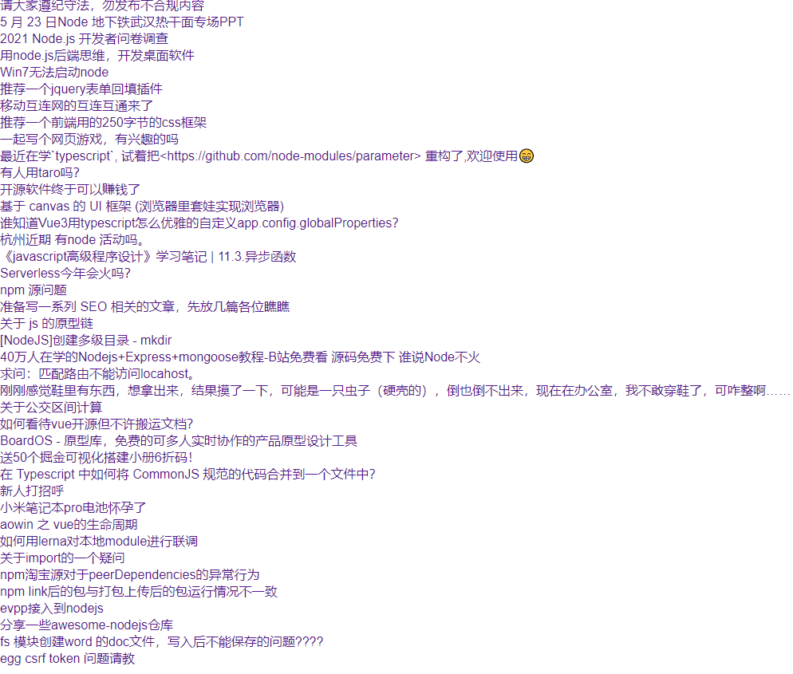

## 1.  Nuxt.js 团队提供官方模块

### 1.分类:

- [@nuxt/http](https://http.nuxtjs.org/): 轻量级和通用的 HTTP 请求
- [@nuxtjs/axios](https://axios.nuxtjs.org/): 安全和使用简单 Axios 与 Nuxt.js 集成用来请求 HTTP


### 2.案例演示

.


实现思路：

1. 下载安装nuxt内置模块@nuxtjs/axios
2. 在nuxt.config.js中注册@nuxtjs/axios
3. 在页面组件asyncData函数的参数结构$axios
4. 发送ajax请求


代码实现：

​    1.安装@nuxtjs/axios

```javascript
yarn add @nuxtjs/axios
```

2. nuxt.config.js注册

   ```javascript
     modules: [
       '@nuxtjs/axios'
     ]
   ```

   

   3.pages/index.vue

```vue
<template>
  <div>
      <ul>
        <li v-for="item in topics" :key="item.id"><a href="#">{{ item.title }}</a></li>
      </ul>
  </div>
</template>

<script>
export default {
 async asyncData ({ $axios, $http}) {
      const {data:{ data:topics}} = await $axios.get('https://cnodejs.org/api/v1//topics');
      // const {data:topics} = await $axios.$get('https://cnodejs.org/api/v1//topics');
     //  const {data:topics} = await $http.$get('https://cnodejs.org/api/v1//topics');
      return {
        topics
      }
  }
};
</script>
```


### 3. baseURL设置

```javascript
  modules: [
    '@nuxt/http',
    '@nuxtjs/axios'
  ],

  axios:{
    baseURL:'https://cnodejs.org/api/v1'
  },
  http:{
    baseURL:'https://cnodejs.org/api/v1'
  }
```


总结：内置模块@nuxtjs/axios, @nuxt/http模块使用需要安装后在nuxt.config.js注册，才能在组件中。
