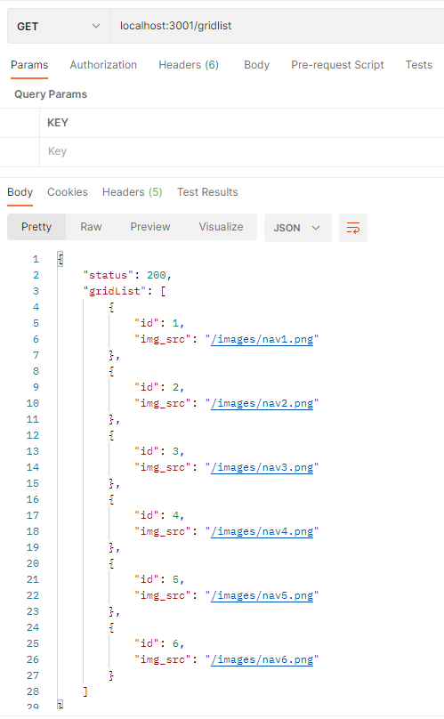

# 1.乐淘demo

## 项目演示

.

## 1.技术栈

​    后端开发语言使用KOA, 数据库使用mysql, 包含微信支付功能, JWT权限验证功能,短信验证功能等

​    服务器： windows server 2012 R2 

## 2. 项目初始化

   1. 安装Koa脚手架

       文档地址：https://www.npmjs.com/package/koa-generator

      ```javascript
      1. npm install -g koa-generator
      ```

   2. 创建KOA项目

      koa2  项目名称(英文)

      

   3. KOA脚手架(生成器) 主要功能包括：

         1. 集成基础的，必要的中间件

         2. app.js:入口文件

         3. bin/www:启动入口

         4. 支持静态服务器

         5. 集成routes路由目录

         6. 支持view视图目录，默认使用pug作为模板引擎

            

   4. 启动项目

      ```javascript
      开发时：
      yarn start  启动项目
      yarn dev    nodemon是修改项目代码后,服务器自动重启,代码改动实时生效
      
      开发完：
      yarn prd   使用pm2 启动node应用程序， PM2是node进程管理工具，可以做到性能监控、自动重启、负载均衡等
      
      
      浏览器运行：
      localhost:3000 
      ```

   5. 相关包的说明

      ```json
      {
        "name": "koa-demo",
        "version": "0.1.0",
        "private": true,
        "scripts": {
          "start": "node bin/www", // 代码变动需要重启node进程
          "dev": "./node_modules/.bin/nodemon bin/www", // 代码变动，通过nodemon自动重启node进程
          "prd": "pm2 start bin/www",// 生产环境 pm2启动
          "test": "echo \"Error: no test specified\" && exit 1"
        },
        "dependencies": {
          "debug": "^4.1.1", // 根据Debug环境变量输出调试日志
          "koa": "^2.7.0", 
          "koa-bodyparser": "^4.2.1",// 解析body，主要针对post请求
          "koa-convert": "^1.2.0", // 兼容Koa2中间件写法
          "koa-json": "^2.0.2", // 对json更好对的支持
          "koa-logger": "^3.2.0", // 开发阶段的日志模块
          "koa-onerror": "^4.1.0", // 错误处理模块
          "koa-router": "^7.4.0", // 路由
          "koa-static": "^5.0.0", // HTTP静态服务器
          "koa-views": "^6.2.0", // 视图渲染
          "pug": "^2.0.3" // 模板引擎
        },
        "devDependencies": {
          "nodemon": "^1.19.1" // 自动重启node进程
        }
      }
      ```

   6. app.js 代码说明

      ```javascript
      const Koa = require('koa') // koa包
      const app = new Koa() // 创建koa实例
      const views = require('koa-views') //视图渲染
      const json = require('koa-json') // 格式化json
      const onerror = require('koa-onerror') // 错误处理模块
      const bodyparser = require('koa-bodyparser') // 针对post请求，解析请求体body
      const logger = require('koa-logger') // 开发阶段日志记录
      // 加载路由
      const index = require('./routes/index')
      const users = require('./routes/users')
      
      // error handler 错误处理
      onerror(app)
      
      // middlewares 挂载中间件
      app.use(bodyparser({
        enableTypes:['json', 'form', 'text']
      }))
      app.use(json())
      app.use(logger())
      // 静态服务器： 主要存放一些静态资源
      app.use(require('koa-static')(__dirname + '/public'))
      // pug模板引擎的配置
      app.use(views(__dirname + '/views', {
        extension: 'pug'
      }))
      
      // logger 日志中间件
      app.use(async (ctx, next) => {
        const start = new Date()
        await next()
        const ms = new Date() - start
        console.log(`${ctx.method} ${ctx.url} - ${ms}ms`)
      })
      
      // routes 路由
      app.use(index.routes(), index.allowedMethods())
      app.use(users.routes(), users.allowedMethods())
      
      // error-handling 错误处理
      app.on('error', (err, ctx) => {
        console.error('server error', err, ctx)
      });
      
      module.exports = app
      
      ```

   7. routes/index.js

      ```javascript
      const router = require('koa-router')()
      
      // 视图渲染
      router.get('/', async (ctx, next) => {
        await ctx.render('index', {
          title: 'Hello Koa 2!'
        })
      })
      
      // 响应字符串
      router.get('/string', async (ctx, next) => {
        ctx.body = 'koa2 string'
      })
      // 响应json
      router.get('/json', async (ctx, next) => {
        ctx.body = {
          title: 'koa2 json'
        }
      })
      
      module.exports = router
      
      ```

      

## 3.MVC模式

**MVC模式**（Model–view–controller）软件开发架构模式，把软件系统分为三个基本部分：模型（Model）、视图（View）和控制器（Controller）。

### 1.Model

 数据模型层，进行数据管理和数据库设计

### 2. View

​    视图层: 前端页面

### 3. Controller

​    负责转发请求，对请求进行处理

#### 4.MVC架构优点

- 低耦合性 视图层和业务层分离，这样就允许更改视图层代码而不用重新编译模型(Model)和控制器代码（controller）
- 方便代码维护拓展

## 4.首页

需要编写三个接口：

- /gridlist     获取宫格数据
- /sports       获取运动专区数据
- /banners    获取轮播图数据


**案例演示：获取宫格数据**

.

###      1. 实现思路

1. 创建 controller/index.js
2. 创建routes/index.js
3. 在app.js中使用路由

​			                

###      2. 代码实现

1.controller/index.js

  ```javascript
  module.exports.gridlist = (ctx) => {
      ctx.body = {
          status: 200,
          gridList: [
              {
                  id: 1,
                  img_src: "/images/nav1.png"
              },
              {
                  id: 2,
                  img_src: "/images/nav2.png"
              },
              {
                  id: 3,
                  img_src: "/images/nav3.png"
              },
              {
                  id: 4,
                  img_src: "/images/nav4.png"
              },
              {
                  id: 5,
                  img_src: "/images/nav5.png"
              },
              {
                  id: 6,
                  img_src: "/images/nav6.png"
              }
          ]
      }
  }
  ```

2.routes目录下的index.js

```javascript

const router = require('koa-router')();

const { gridlist  } = require('../Controller/index');

//获取宫格列表
router.get('/gridList', gridlist);

module.exports = router;
```

3.app.js

```javascript
const index = require('./routes/index')
app.use(index.routes(), index.allowedMethods())
```


首页需要的另外两个接口以此类推

1.controller/index.js

```javascript
// 运动专区
module.exports.sportList = (ctx,) => {
    ctx.body = {
        status: 200,
        sports: [
            {
                name: 'adidas阿迪达斯 男式 场下休闲篮球鞋S83700',
                img: '/images/product.jpg',
                price: 1.00,
                oldPrice: 888.00
            },
            {
                name: 'FORUM 84 LOW 新款低帮经典运动鞋',
                img: '/images/product.jpg',
                price: 1.00,
                oldPrice: 899.00
            },
            {
                name: 'adidas阿迪达斯 男式 场下休闲篮球鞋S83700',
                img: '/images/product.jpg',
                price: 1.00,
                oldPrice: 888.00
            },
            {
                name: 'adidas阿迪达斯 男式 场下休闲篮球鞋S83700',
                img: '/images/product.jpg',
                price: 1.00,
                oldPrice: 888.00
            }
        ]
    }
}

// banner专区
module.exports.swipeList = (ctx) => {
    ctx.body = {
        status: 200,
        swipeList: [
            {
                id: 1,
                img_src: "/images/banner1.png",
            },
            {
                id: 2,
                img_src: "/images/banner2.png",
            },
            {
                id: 3,
                img_src: "/images/banner3.png",
            },
            {
                id: 4,
                img_src: "/images/banner4.png",
            },
            {
                id: 5,
                img_src: "/images/banner5.png",
            },
        ]
    }
}
```

routes/index.js

```javascript

const router = require('koa-router')();

const { sportList, swipeList  } = require('../Controller/index');


// 获取运动专区
router.get('/sports', sportList);

// 获取轮播图
router.get('/banners', swipeList);

module.exports = router;
```


## 5.分类页面一级分类接口

​    数据库:letao

### 1.用到的分类表:

- category 一级分类
- brand 二级分类

​     category 一级分类


1.创建category 表: 

```sql
-- letao.category definition  一级分类

CREATE TABLE `category` (
  `id` int(11) NOT NULL AUTO_INCREMENT,    
  `categoryName` varchar(50) DEFAULT null,  
  PRIMARY KEY (`id`)
) ENGINE=InnoDB AUTO_INCREMENT=1 DEFAULT CHARSET=utf8;
```

 category表插入测试数据

```sql
insert  into `category`(`id`,`categoryName`) values (1,'运动馆'),(2,'女士馆'),(3,'男士馆'),(4,'帆布馆'),(5,'户外管');
```

 2.brand表 二级分类表

  创建brand表

   ```sql
   CREATE TABLE `brand` (
     `id` int(11) NOT NULL AUTO_INCREMENT,
     `brandName` varchar(50) DEFAULT NULL,
     `categoryId` int(11) DEFAULT NULL,
     `brandLogo` varchar(200) DEFAULT NULL,
     `hot` int(4) DEFAULT NULL,
     PRIMARY KEY (`id`)
   ) ENGINE=InnoDB AUTO_INCREMENT=1 DEFAULT CHARSET=utf8;
   ```

 brand表插入测试数据

```javascript
insert  into `brand`(`id`,`brandName`,`categoryId`,`brandLogo`,`hot`) values (1,'耐克',1,'/images/brand1.png',1),(2,'阿迪',1,'/images/brand2.png',1),(3,'新百伦',1,'/images/brand3.png',1),(4,'哥伦比亚',1,'/images/brand4.png',0),(5,'匡威',1,'/images/brand5.png',1),(6,'阿萨德1',2,'/images/brand5.png',1),(7,'阿萨德2',2,'/images/brand5.png',1);
```


### 2.安装mysql

文档地址：https://www.npmjs.com/package/mysql

 ```javascript
yarn add mysql
 ```


#### 2.1 测试数据库连接

```javascript
var mysql = require('mysql');
// 创建连接池
var pool  = mysql.createPool({
  connectionLimit : 10, // 连接池最大连接数
  host            : 'localhost',
  user            : 'root',
  password        : '123456',
  database        : 'letao'
});
 
pool.query('SELECT 1 + 1 AS solution', function (error, results, fields) {
  if (error) throw error;
  console.log('The solution is: ', results[0].solution);
});
```


#### 2.2 创建连接池

```javascript
var mysql = require('mysql');
// 创建连接池
var pool  = mysql.createPool({
  connectionLimit : 10, // 连接池最大连接数
  host            : 'localhost',
  user            : 'root',
  password        : '123456',
  database        : 'letao'
});
 
// 开始连接数据
pool.getConnection(function(err, connection) {
    if (err) throw err; // not connected!
   
    // Use the connection
    connection.query('select * from category', function (error, results, fields) {
      // When done with the connection, release it.
      connection.release();
   
      // Handle error after the release.
      if (error) throw error;
   
      // Don't use the connection here, it has been returned to the pool.
      console.log(results);
    });
  });
```

#### 2.3 封装sql查询函数

```javascript
var mysql = require('mysql');
// 创建连接池
var pool = mysql.createPool({
    connectionLimit: 10, // 连接池最大连接数
    host: 'localhost',
    user: 'root',
    password: '123456',
    database: 'letao'
});


// 封装sql查询函数
module.exports.query = (sql) => {
    return new Promise((resolve, reject) => {
        // 开始连接数据
        pool.getConnection(function (err, connection) {
            if (err) throw err; // not connected!

            // Use the connection
            connection.query(sql, function (error, results, fields) {
                // When done with the connection, release it.
                connection.release();

                // Handle error after the release.
                if (error) throw error;

                // Don't use the connection here, it has been returned to the pool.
                resolve(results);
            });
        });
    });
}

```

### 3.接口编写  

#### 1.一级分类

routes/category.js

```javascript
const router = require('koa-router')();
const { query } = require('../db/query')


// 获取一级分类
router.get('/oneCategory', async (ctx)=>{
    console.log(11);
    let oneCategory = await query('select * from category');
    ctx.body = {
        status:200,
        oneCategory
    }
});

module.exports = router;
```

app.js 新增两行代码

```javascript

const category = require('./routes/category')

// routes 路由
app.use(category.routes(), category.allowedMethods())
```


#### 2.MVC结构

1. 拆分routes/category.js 中一级分类路由匹配后的业务处理到controller/category.js

  controller目录下category.js

```javascript
const { query } = require('../db/query')
// 获取一级分类
module.exports.oneCategory = async (ctx) => {
    let oneCategory = await query('select * from category');
    ctx.body = {
        status:200,
        oneCategory
    }
}
```


routes/category.js

```javascript
const router = require('koa-router')();
const { oneCategory } = require('../controller/category');

// 获取一级分类
router.get('/oneCategory', oneCategory);

module.exports = router;
```


**以上代码存在的问题**：

​	controller层和model层紧耦合，需要把sql查询功能进一步拆分到model层

model/category.js

```javascript
const { query } = require('../db/query')
// 获取一级分类
module.exports.oneCategory = async () =>{
    return await query('select * from category');
}
```

controller/category.js

```javascript
const { oneCategory } = require('../model/category');
// 获取一级分类
module.exports.oneCategory = async (ctx) => {
    let oneCategoryList = await oneCategory()
    ctx.body = {
        status:200,
        oneCategoryList
    }
}
```


总结： 当前分类页面使用的到的一级分类接口已按照MVC模式完成开发


## 6. 管理项目各种配置

### 1.问题： 

​    此时的数据库配置耦合到业务代码中，需要抽离

### 2.创建数据库配置文件

​    db/dbConfig.js

  ```javascript
  module.exports.dbConfig = {
      connectionLimit: 10, // 连接池最大连接数
      host: 'localhost',
      user: 'root',
      password: '123456',
      database: 'letao'
  }
  ```

### 3.数据库配置文件进一步升级

   以上配置无法区分开发环境，测试环境，生成环境，因此需要优化

####  1. 设置NODE环境变量

  安装dotenv

  文档地址：https://www.npmjs.com/package/dotenv

```javascript
yarn add dotenv
```

####  2.项目根目录新建.env

```javascript
# 数据库主机
DB_HOST = "localhost"
# 数据库用户名
DB_USER = "root"
# 数据库密码
DB_PWD = "123456"
# 数据库名称
DB_DATABASE  = "letao"
```

#### 3.app.js  

 注意：dotenv配置代码先运行

```javascript
const Koa = require('koa') // koa包
const app = new Koa() // 创建koa实例
const views = require('koa-views') //视图渲染
const json = require('koa-json') // 格式化json
const onerror = require('koa-onerror') // 错误处理模块
const bodyparser = require('koa-bodyparser') // 针对post请求，解析请求体body
const logger = require('koa-logger') // 开发阶段日志记录
const dotenv = require('dotenv') // 环境变量配置

// 启动Node env环境 先运行
dotenv.config();

// 加载路由
const index = require('./routes/index')
const users = require('./routes/users')
const category = require('./routes/category')


// error handler 错误处理
onerror(app)

// middlewares 挂载中间件
app.use(bodyparser({
  enableTypes:['json', 'form', 'text']
}))
app.use(json())
app.use(logger())
// 静态服务器： 主要存放一些静态资源
app.use(require('koa-static')(__dirname + '/public'))
// pug模板引擎的配置
app.use(views(__dirname + '/views', {
  extension: 'pug'
}))

// logger 日志中间件
app.use(async (ctx, next) => {
  const start = new Date()
  await next()
  const ms = new Date() - start
  console.log(`${ctx.method} ${ctx.url} - ${ms}ms`)
})

// routes 路由
app.use(index.routes(), index.allowedMethods())
app.use(users.routes(), users.allowedMethods())
app.use(category.routes(), category.allowedMethods())

// error-handling 错误处理
app.on('error', (err, ctx) => {
  console.error('server error', err, ctx)
});

module.exports = app

```


## 7.分类页面二级分类接口

### 1.model/catrgory.js

```javascript

// 获取二级分类
module.exports.twoCategory = async (id) =>{
    return await query('select * from brand where id = ?',[id]);
}
```

以上代码明显query调用时多了一个参数id，所以需要修改query封装，支持传递参数查询sql


### 2.db/query.js

```javascript
var mysql = require('mysql');
var { dbConfig } = require('./dbConfig');
// 创建连接池
var pool = mysql.createPool(dbConfig);


// 封装sql查询函数
module.exports.query = async (sql, values) => {
    return new Promise((resolve, reject) => {
        // 开始连接数据
        pool.getConnection(function (err, connection) {
            if (err) throw err; // not connected!

            // Use the connection
            connection.query(sql,values, function (error, results, fields) {
                // When done with the connection, release it.
                connection.release();

                // Handle error after the release.
                if (error) throw error;

                // Don't use the connection here, it has been returned to the pool.
                resolve(results);
            });
        });
    });
}
```

### 3.controllers/category.js

```javascript
// 获取二级分类
module.exports.twoCategory = async (ctx) =>{
    const { id } = ctx.request.query;
    let  twoCategoryList = await twoCategory(id);
    ctx.body = {
        status:200,
        twoCategoryList
    }
}   
```


