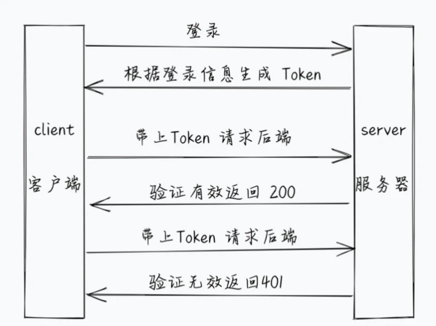

# JSON网络令牌JWT

## 1.什么是身份验证

​      日常生活中的**身份验证**的场景:  比如进入公司的大楼时，需要携带工牌；打卡上班时，需要指纹识别；打开工作电脑时，需要输入密码。

## 2. 什么是 JSON 网络令牌？

JSON Web Token (JWT) 是一个开放标准 ( [RFC 7519](https://tools.ietf.org/html/rfc7519) )，用于在各方之间作为 JSON 对象安全地传输信息。就是通过用户名和密码来生成token确认用户的身份，确认过身份的用户称为为**授权用户(Authenticated user)**。

全称 `JSON Web Token`， 是目前最流行的跨域认证解决方案。基本的实现是服务端认证后，生成一个 `JSON` 对象，发回给用户。用户与服务端通信的时候，都要在请求头带上这个 `JSON` 对象

## 3.  JSON 网络令牌的作用

- **授权**：这是使用 JWT 最常见的场景。用户登录后，每个后续请求都将包含 JWT，允许用户访问该令牌允许的路由、服务和资源。

## 4. JSON Web Token 结构

在其紧凑形式中，JSON Web Tokens 由用点 ( `.`)分隔的三个部分组成，它们是：

- 标题

    ```javascript
    {"alg":"HS256","typ":"JWT"}
    ```

- 有效载荷

  - ```javascript
    {"username":"letao","password":"123456","iat":1634524068,"exp":1634527668}
    ```

  - 

- 签名

  

因此，JWT 通常如下所示。

```
xxxxx.yyyyy.zzzzz
```

 JWT格式: 

## 5.JSON 网络令牌如何工作？

在身份验证中，当用户使用其凭据成功登录时，将返回 JSON Web Token。由于令牌是凭证，因此必须非常小心以防止出现安全问题。通常，您不应将令牌保留的时间超过所需的时间。

每当用户想要访问受保护的路由或资源时，用户代理应该发送 JWT，通常在使用**Bearer**模式的**Authorization**标头中。标题的内容应如下所示：

```
Authorization: Bearer <token>
```

.


## 5.代码实现

  文档地址： https://www.npmjs.com/package/jsonwebtoken

   1. 安装```jsonwebtoken``` 

         ```javascript
         yarn add jsonwebtoken
         ```

​     2.controller目录user.js

1. 登录成功之后使用jsonwebtoken根据用户名和密码生成token返回

```javascript

const userModel = require('../model/user');
const { validator, cryptoPwd } = require('../utils/utils');
const { config:{encrypStr , secret} } = require('../config/config');
const jwt = require('jsonwebtoken');

// 用户登录
module.exports.login = async (ctx) => {
    // 1. 获取登录信息
    const { username, password } = ctx.request.body;
    let msg = validator.checkUserName(username) || validator.checkPassword(password)
    if (msg) {
        ctx.body = {
            msg,
            status: 1010
        }
    }
    // 2. 登录
    const result = await userModel.login(username, cryptoPwd(password + encrypStr));


    const token =  await jwt.sign({
        username,
        password
    }, secret, { expiresIn: 36 * 60 * 60 }); // 
    if (result[0]) {
        ctx.body = {
            status: 200,
            token,
            msg: '登录成功'
        }
    } else {
        ctx.body = {
            status: 1040,
            msg: '登录失败'
        };
    }

}
```

   3. 验证JSON Web 令牌的 Koa 中间件

      文档地址：https://www.npmjs.com/package/koa-jwt

   1. 安装koa-jwt

      ```javascript
      yarn add koa-jwt
      ```

   2. app.js

      ```javascript
      const Koa = require('koa') // 引入KOA
      const app = new Koa() // 创建KOA应用实例
      const views = require('koa-views') // 处理动态模板
      const json = require('koa-json')  // 格式化输出的json
      const onerror = require('koa-onerror') // 捕获异常
      const bodyparser = require('koa-bodyparser') // 处理post请求
      const logger = require('koa-logger') // 日志记录
      const dotenv = require('dotenv');
      var xmlParser = require('koa-xml-body');
      var jwt = require('koa-jwt');
      const {config:{secret}} = require('./config/config');
      
      // 启动Node env环境
      dotenv.config();
      
      // 加载路由
      const order = require('./routes/order')
      const user = require('./routes/user')
      
      // error handler  错误处理
      onerror(app)
      
      app.use(xmlParser());
      
      // middlewares  使用中间件
      app.use(function(ctx, next){
        return next().catch((err) => {
          if (401 == err.status) {
            ctx.status = 401;
            ctx.body = 'Protected resource, use Authorization header to get access\n';
          } else {
            throw err;
          }
        });
      });
      app.use(jwt({ secret }).unless({ path: [/^\/public/, /^\/login/]}))
      app.use(bodyparser({
        enableTypes: ['json', 'form', 'text']
      }))
      app.use(json())
      app.use(logger())
      app.use(require('koa-static')(__dirname + '/public'))
      
      // 动态文件模板处理
      app.use(views(__dirname + '/views', {
        extension: 'pug'
      }))
      
      // logger 日志输出
      app.use(async (ctx, next) => {
        const start = new Date()
        await next()
        const ms = new Date() - start
        console.log(`${ctx.method} ${ctx.url} - ${ms}ms`)
      })
      
      // routes 注册路由
      app.use(order.routes(), order.allowedMethods())
      app.use(user.routes(), user.allowedMethods())
      
      // error-handling  错误处理
      app.on('error', (err, ctx) => {
        console.error('server error', err, ctx)
      });
      
      module.exports = app
      
      ```


## 参考资料：

1. koa-jwt: https://www.npmjs.com/package/koa-jwt
2. mysql:https://www.npmjs.com/package/mysql
3. crypto加密: https://nodejs.org/dist/latest-v14.x/docs/api/crypto.html
4. koa: https://koa.bootcss.com/#context
5. jwt: https://jwt.io/introduction
6. jsonwebtoken: https://www.npmjs.com/package/jsonwebtoken