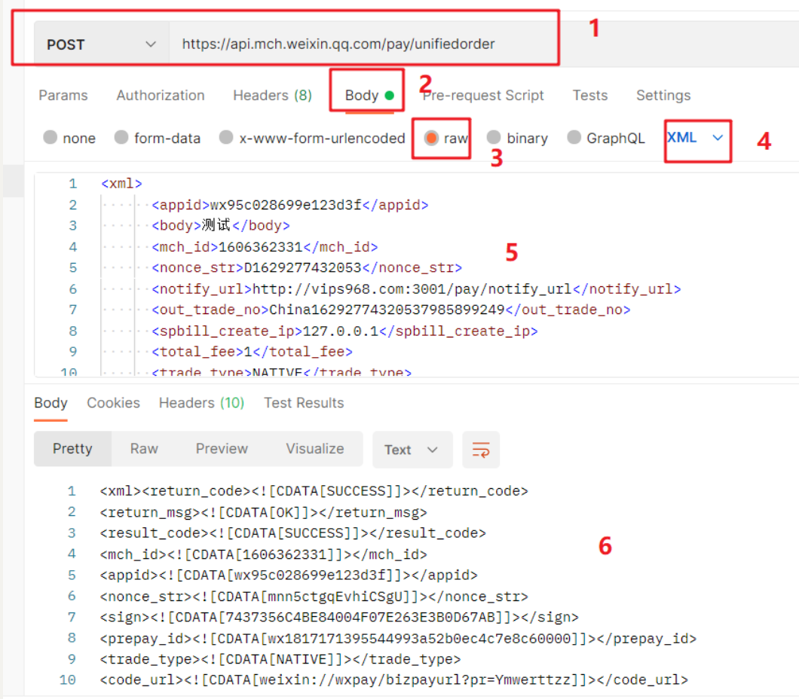

## 1. 微信支付

- 文档地址：https://pay.weixin.qq.com/wiki/doc/api/index.html
- 扫码支付是指商户系统按微信支付协议生成支付二维码，用户再用微信“扫一扫”来完成支付。


## 2. 申请流程

### 2.1 注册公众号

请根据营业执照类型选择以下主体注册：

- [个体工商户](http://kf.qq.com/faq/120911VrYVrA151009JB3i2Q.html)
- [企业/公司](http://kf.qq.com/faq/120911VrYVrA151013MfYvYV.html)
- [政府](http://kf.qq.com/faq/120911VrYVrA15100973ABZz.html)
- [媒体](http://kf.qq.com/faq/120911VrYVrA151013aMNfeQ.html)
- [其他组织](http://kf.qq.com/faq/120911VrYVrA151013nYFZ7Z.html)

### 2.2 认证公众号

公众号认证后才可申请微信支付，认证费：300元/次 查看[认证流程](http://kf.qq.com/product/weixinmp.html#hid=97)

### 2.3 提交资料申请微信支付

登录公众平台，点击左侧菜单【微信支付】，开始填写资料等待审核，审核时间为48小时内。

### 2.4 开户成功，进行账户验证

资料审核通过后，开户信息会通过邮件、公众号发送给联系人，请按照指引填写财付通备付金汇入的随机金额，完成账户验证。（查看验证方法）

### 2.5 在线签署协议

本协议为线上电子协议，签署后方可进行交易及资金结算，签署完立即生效。点此提前预览协议内容。

### 2.6 启动设计和开发

支付接口已获得，可根据[开发文档](https://pay.weixin.qq.com/wiki/doc/api/index.html)进行开发，也可了解成功案例界面示意及素材。

## 3. 准备素材

- [扫码支付](https://pay.weixin.qq.com/wiki/doc/api/native.php?chapter=6_1)
- APPID [公众平台](https://mp.weixin.qq.com/)(1959583119)->右上角->开发者ID->AppID
- 商户号码和配置回调链接 [商户平台](https://pay.weixin.qq.com/)->产品中心->开发配置->商户信息->商户号
- 配置APPID [商户平台](https://pay.weixin.qq.com/)->产品中心->APPID授权管理
- API密钥 [商户平台](https://pay.weixin.qq.com/)->账户中心->API安全->设置API密钥

## 4.接入流程

- 商户后台系统先调用微信支付的统一下单接口
- ### 微信后台系统返回链接参数code_url
- 商户后台系统将code_url值生成二维码图片
- 用户使用微信客户端扫码后发起支付
- 注意：code_url有效期为2小时，过期后扫码不能再发起支付。


业务流程说明：

- 1）商户后台系统根据用户选购的商品生成订单。
- 2）用户确认支付后调用微信支付[统一下单API](https://pay.weixin.qq.com/wiki/doc/api/native.php?chapter=9_1)生成预支付交易；
- 3）微信支付系统收到请求后生成预支付交易单，并返回交易会话的二维码链接code_url。
- 4）商户后台系统根据返回的code_url生成二维码。
- 5）用户打开微信“扫一扫”扫描二维码，微信客户端将扫码内容发送到微信支付系统。
- 6）微信支付系统收到客户端请求，验证链接有效性后发起用户支付，要求用户授权。
- 7）用户在微信客户端输入密码，确认支付后，微信客户端提交授权。
- 8）微信支付系统根据用户授权完成支付交易。
- 9）微信支付系统完成支付交易后给微信客户端返回交易结果，并将交易结果通过短信、微信消息提示用户。微信客户端展示支付交易结果页面。
- 10）微信支付系统通过发送异步消息通知商户后台系统支付结果。商户后台系统需回复接收情况，通知微信后台系统不再发送该单的支付通知。
- 11）未收到支付通知的情况，商户后台系统调用[查询订单API](https://pay.weixin.qq.com/wiki/doc/api/native.php?chapter=9_2)
- 12）商户确认订单已支付后给用户发货。

## 5.沙箱测试

### 1.1 文档地址：

​          http://mp.weixin.qq.com/debug/cgi-bin/sandboxinfo?action=showinfo&t=sandbox/index

### 1.2 测试号：

```javascript
 appId: 'wx045745a074f22a9f', // 测试环境
 appSecret: 'a3b77cbd62e67197bda0482a4d266106'   // 秘钥
```

### 1.3正式环境

```javascript
appid： 	自己的apppid
mch_id：自己的商户id(需要个体户或者公司注册才可以有)
key：   自己的key
```

## 6.微信支付实现流程（native扫码支付）

       1. 调用下单接口拿到支付二维码
       2. 扫码付款成功之后会回调接口（必须部署在服务器上外网可以访问），完成订单存储到mysql
       3. 调用微信订单查询接口,查询用户支付状态

###  一：微信Native下单

​         文档地址：https://pay.weixin.qq.com/wiki/doc/api/index.html

​         postman测试接口:

​	     请求参数:

      <xml>
            <appid>wx95c028699e123d3f</appid>
            <body>测试</body>
            <mch_id>1606362331</mch_id>
            <nonce_str>D1629277432053</nonce_str>
            <notify_url>http://vips968.com:3001/pay/notify_url</notify_url>
            <out_trade_no>China16292774320537985899249</out_trade_no>
            <spbill_create_ip>127.0.0.1</spbill_create_ip>
            <total_fee>1</total_fee>
            <trade_type>NATIVE</trade_type>
            <sign>812D86C45234CD6A189B881C24B41449</sign>
      </xml>

​       返回数据:

``` xml
<xml>
    <return_code><![CDATA[SUCCESS]]></return_code>
    <return_msg><![CDATA[OK]]></return_msg>
    <result_code><![CDATA[SUCCESS]]></result_code>
    <mch_id><![CDATA[1606362331]]></mch_id>
    <appid><![CDATA[wx95c028699e123d3f]]></appid>
    <nonce_str><![CDATA[3SQGZ6hZHKDePZu5]]></nonce_str>
    <sign><![CDATA[D3B5906A6205E4BFF01CEFCB30620F4F]]></sign>
    <prepay_id><![CDATA[wx18171217836292e6955c892133450b0000]]></prepay_id>
    <trade_type><![CDATA[NATIVE]]></trade_type>
    <code_url><![CDATA[weixin://wxpay/bizpayurl?pr=eg3n2ttzz]]></code_url>
</xml>
```

​       postman测试



订单表order

```sql
CREATE TABLE `payorder` (
  `id` int(11) NOT NULL AUTO_INCREMENT,
  `appid` varchar(50) NOT NULL,
  `bank_type` varchar(50) NOT NULL,
  `cash_fee` varchar(50) NOT NULL,
  `fee_type` varchar(50) NOT NULL,
  `is_subscribe` varchar(50) NOT NULL,
  `mch_id` varchar(50) NOT NULL,
  `nonce_str` varchar(50) NOT NULL,
  `openid` varchar(50) NOT NULL,
  `out_trade_no` varchar(50) NOT NULL,
  `sign`varchar(50) NOT NULL,
  `time_end` varchar(50) NOT NULL,
  `total_fee` varchar(50) NOT NULL,
  `trade_type`  varchar(50) NOT NULL,
  `transaction_id` varchar(50) NOT NULL,
   PRIMARY KEY (`id`)
)
```

####       1. controller目录下新建order.js

```javascript
const { payconfig: { wx: { appid, mchid } } } = require('../config/payConfig');
const { getOrderNo, getRandomStr, createSign, createOrder, getOrder } = require('../utils/utils');
const { config: { wx_notify_url, orderUrl, queryOrderUrl } } = require('../config/config');
const QRCode = require('qrcode');
let flag = false;
const commonParams = {
    // 随机字符串
    nonce_str: getRandomStr(),
    // 随机订单号
    out_trade_no: getOrderNo()
}

// 微信下单
module.exports.order = async (ctx) => {
    const { body, ip, total_fee, trade_type } = ctx.request.body;
    // // 随机字符串
    // const nonce_str = getRandomStr();
    // // 随机订单号
    // const out_trade_no = getOrderNo();
    const { nonce_str, out_trade_no } = commonParams;
    // 生成签名请求的参数
    let params = {
        appid,
        body,
        mch_id: mchid,
        nonce_str,
        notify_url: wx_notify_url,
        out_trade_no,
        spbill_create_ip: ip,
        total_fee,
        trade_type,
    }
    // 生成签名
    let sign = createSign(params);
    // 请求参数
    let sendData = `<xml>
      <appid>${appid}</appid>
      <body>${body}</body>
      <mch_id>${mchid}</mch_id>
      <nonce_str>${nonce_str}</nonce_str>
      <notify_url>${wx_notify_url}</notify_url>
      <out_trade_no>${out_trade_no}</out_trade_no>
      <spbill_create_ip>${ip}</spbill_create_ip>
      <total_fee>${total_fee}</total_fee>
      <trade_type>${trade_type}</trade_type>
      <sign>${sign}</sign>
   </xml>`;
    console.log(sendData, 'sendData');

    try {
        // 微信下单
        const data = await createOrder(orderUrl, sendData);
        const payUrl = await QRCode.toDataURL(data.code_url[0]);
        data.payUrl = payUrl;
        // 根据微信下单二维码创建支付二维码
        ctx.body = {
            status: 200,
            data
        }
    } catch (error) {
        // 如果已经支付
        console.log('err', error);
        ctx.body = {
            status:1050,
            data:error.xml.err_code_des[0]
        }

        
    }


}
```

​      工具类utils.js

```javascript
const { payconfig: { wx: { key } } } = require('../config/payConfig');
const axios = require('axios');
const crypto = require('crypto');
const xml = require('xml2js');
const validator = require('validator');

// 生成交易单号
module.exports.getOrderNo = () => {
    // 日期时间戳字符串
    const date = new Date().getTime().toString();
    const str = '0123456789';
    // 随机字符串
    let text = '';
    for (let i = 0; i < 10; i++) {
        text += str[str[this.getRandom(0, 9)]];
    }
    console.log(text, 'text');
    // 返回32位以内的随机字符串
    return 'China' + date + text;
}
// 生成随机字符串
module.exports.getRandomStr = () => {
    return 'D' + new Date().getTime();
}

// 生成签名
module.exports.createSign = (args) => {
    // 对参数按照key=value的格式，并按照参数ASCII字典排序
    let sortedParams = ''
    Object.keys(args).sort().forEach((key) => {
        sortedParams += `${key}=${args[key]}&`;
    });
    sortedParams += `key=${key}`;
    console.log(sortedParams, 'sortedParams');
    let sign = crypto.createHash('MD5').update(sortedParams).digest('hex').toUpperCase();
    return sign
}

// 生成指定范围的随机整数
module.exports.getRandom = (min, max) => {
    return Math.floor(Math.random() * (max - min) + 1);
}

// 微信下单
module.exports.createOrder = (url,params) => {
    return new Promise(async (resolve, reject) => {
        // 发送下单请求
        const data = await axios({
            url,
            method: 'POST',
            data:params
        });

        // 解析返回的xml格式
        xml.parseString(data.data, (error, res) => {
            if (res.xml.return_code == 'SUCCESS' && res.xml.return_msg == 'OK' && res.xml.result_code == "SUCCESS") {
                resolve(res.xml)
            } else {
                reject(res);
            }
        });
    })
}

// 查询微信下单的订单
module.exports.getOrder = (url, params) =>{
    return new Promise( async (resolve, reject) =>{
        const data = await axios({
            url,
            method: 'POST',
            data:params
        });

        // 解析返回的xml格式
        xml.parseString(data.data, (error, res) => {
            console.log(res.xml);
            if (res.xml.return_code == 'SUCCESS' && res.xml.return_msg == 'OK' && res.xml.result_code == "SUCCESS") {
                resolve(res.xml)
            } else {
                reject(res);
            }
            
        });

    });
}

```


#### 2：路由设置 新建order.js

```javascript
const router = require('koa-router')();
const { order,notify, queryOrder} = require('../controller/order');


// 微信下单
router.post('/wx/order', order);

module.exports = router;
```

#### 3:app.js

```javascript
// 加载路由
const order = require('./routes/order')
// routes 注册路由
app.use(order.routes(), order.allowedMethods())
```

### 二： 扫码支付

 要求：

   	1. 部署到服务器上
   	2. 域名需要备案外网可以访问

####    1.controller目录order.js

```javascript
// 下单后的通知回调
module.exports.notify = async (ctx) => {
    console.log(ctx.request.body.xml, 'ctx.request.body.xml')
 
        const { appid, bank_type,cash_fee,fee_type,is_subscribe,mch_id,nonce_str,openid,out_trade_no,sign,time_end,total_fee,trade_type,transaction_id } = ctx.request.body.xml;
       // 根据订单号查询是否已经创建订单
       const result = await query('select out_trade_no from payorder')
       if (result[0]) return; 
        // 在数据库中保存订单信息
        await query(`insert into payorder(appid, bank_type,cash_fee,fee_type,is_subscribe,mch_id,nonce_str,openid,out_trade_no,sign,time_end,total_fee,trade_type,transaction_id) values('${appid}','${bank_type}','${cash_fee}','${fee_type}','${is_subscribe}','${mch_id}','${nonce_str}','${openid}','${out_trade_no}','${sign}','${time_end}','${total_fee}','${trade_type}','${transaction_id}')`);
    
}
```

#### 2.routes目录 order.js中

```javascript
const router = require('koa-router')();

const { order,notify } = require('../controller/order');

// 微信下单
router.post('/order', order);

// 微信下单后通知
router.post('/pay/notify',notify)

module.exports = router;
```

### 三: 微信订单查询

 文档地址：https://pay.weixin.qq.com/wiki/doc/api/index.html

####     1. controller目录下的order.js

```javascript
// 查询微信订单
module.exports.queryOrder = async (ctx) =>{
    // 生成签名
    let sign = createSign({
        appid,
        mch_id,
        nonce_str,
        out_trade_no
    })
    let sendData = `
    <xml>
   <appid>${appid}</appid>
   <mch_id>${mch_id}</mch_id>
   <nonce_str>${nonce_str}</nonce_str>
   <out_trade_no>${out_trade_no}</out_trade_no>
   <sign>${sign}</sign>
   </xml>`;

   const data = await getOrder('https://api.mch.weixin.qq.com/pay/orderquery', sendData);
    ctx.body = {
        status: 200,
        data
    };
}
```

所用的工具类库utils.js

```javascript
// 查询订单
module.exports.getOrder = (url,params) =>{
    return new Promise(async (resolve, reject) => {
        // 发送下单请求
        const data = await axios({
            url,
            method: 'POST',
            data:params
        });
        // 解析返回的xml格式
        xml.parseString(data.data, (error, res) => {
            console.log(res.xml,'res222');
            if (res.xml.return_code == 'SUCCESS' && res.xml.return_msg == 'OK' && res.xml.result_code == "SUCCESS") {
                resolve(res.xml)
            } else {
                reject(res);
            }
        });
    })
}
```

#### 2. routes目录下 order.js

```javascript
const router = require('koa-router')();

const { order,notify,queryOrder } = require('../controller/order');

// 微信下单
router.post('/order', order);

// 微信下单后通知
router.post('/pay/notify',notify);

// 微信查询订单
router.post('/queryOrder',queryOrder)


module.exports = router;
```


## 7.订单表

### 1.目标： 订单表在什么时候开始写入数据

     1. 我们调用微信下单接口，根据生成code_url使用qrcode生成支付二维码，返给前端，此时订单就产生，只不过是用户还没有支付而已，此时，我们把订单数据写入到数据库 ， 这时订单状态是未支付， 当用户在页面点击下单购买，需要扫描支付二维码，当用户付款成功时， 微信服务器要回调乐淘服务端接口，此时需要把订单支付状态改成已支付。


## 8.订单表数据

### 1.目标

​	  我们在订单生成时，把订单数据存到数据表payorder， 用户支付成功，把payorder订单表中支付状态改成已支付。

### 2.实现思路

1.   使用utils/index.js 中的query方法 在订单生成后，写入订单数据到payorder


###  3.代码实现

controller/order.js

```javascript
module.exports.order = async (ctx) => {
    // 前端调用下单接口时传递的参数
    const { body, total_fee, spbill_create_ip, trade_type,nonce_str, out_trade_no} = ctx.request.body;
    // 生成sign需要的参数
    const params = {
        appid,
        mch_id,  // 商户号
        nonce_str, // 32位以内的随机字符串
        // sign, // 签名
        body, // 商品描述
        out_trade_no, // 商户订单号
        total_fee, // 金额
        spbill_create_ip,  // 终端ip
        notify_url, // 微信服务器回调的地址
        trade_type,  // 支付类型
    }
    nonce_str = getRandomStr();// 随机字符串
    // 生产签名  需要你发送的参数生成
    const sign = createSign(params);
    //微信下单请求参数    
    let sendData = `
            <xml>
                <appid>${appid}</appid>
                <body>${body}</body>
                <mch_id>${mch_id}</mch_id>
                <nonce_str>${params.nonce_str}</nonce_str>
                <notify_url>${notify_url}</notify_url>
                <out_trade_no>${params.out_trade_no}</out_trade_no>
                <spbill_create_ip>${spbill_create_ip}</spbill_create_ip>
                <total_fee>${total_fee}</total_fee>
                <trade_type>${trade_type}</trade_type>
                <sign>${sign}</sign>
            </xml>
   `
    const data = await orderHandle(orderUrl, sendData);

    // 下单成功
    const { return_code, return_msg, result_code, code_url } = data;
    if (return_code == 'SUCCESS' && return_msg == 'OK' && result_code == "SUCCESS") {
        // 把订单数据写入到payorder
        await query(`insert into payorder (appid,mch_id,nonce_str,body,out_trade_no,total_fee,spbill_create_ip,trade_type,trade_state) values ("${appid}","${mch_id}","${nonce_str}","${body}","${out_trade_no}","${total_fee}","${spbill_create_ip}","${trade_type}","NOTPAY")`);
        data.payUrl = await QRCode.toDataURL(code_url)
    }

    ctx.body = {
        status: 200,
        data
    }
}
```


### 4.总结

调用微信下单接口，订单生成时，需要把订单数据吸入，支付成功时，在回调通知接口中，根据商户订单号更新订单状态


## 9.商户订单号还有随机字符串

### 1.目标

   我们目前微信下单时，随机字符串，商户订单号，在服务端生成的，我们遇到一个问题？ 微信下单和订单查询使用参数随机字符串，商户订单号是一致的，导致两个该在何时生成？？？   

### 2.实现思路

1. 两种方案， 第一种是把随机字符串和商户订单号，在服务端生成，返回给前端。
   1. 为什么要给前端呢？ 	是因为前端需要调用订单查询接口，需要使用微信下单时的随机字符串，商户订单号
2. 第二种，在客户端生成，由客户端传给服务端。

### 3.代码实现

```javascript
// 微信下单
module.exports.order = async (ctx) => {
    // 前端调用下单接口时传递的参数
    const { body, total_fee, spbill_create_ip, trade_type} = ctx.request.body;
    // 生成sign需要的参数
    const params = {
        appid,
        mch_id,  // 商户号
        nonce_str:getRandomStr(), // 32位以内的随机字符串
        // sign, // 签名
        body, // 商品描述
        out_trade_no:getTrade_no(), // 商户订单号
        total_fee, // 金额
        spbill_create_ip,  // 终端ip
        notify_url, // 微信服务器回调的地址
        trade_type,  // 支付类型
    }
    // 生产签名  需要你发送的参数生成
    const sign = createSign(params);
    //微信下单请求参数    
    let sendData = `
            <xml>
                <appid>${appid}</appid>
                <body>${body}</body>
                <mch_id>${mch_id}</mch_id>
                <nonce_str>${params.nonce_str}</nonce_str>
                <notify_url>${notify_url}</notify_url>
                <out_trade_no>${params.out_trade_no}</out_trade_no>
                <spbill_create_ip>${spbill_create_ip}</spbill_create_ip>
                <total_fee>${total_fee}</total_fee>
                <trade_type>${trade_type}</trade_type>
                <sign>${sign}</sign>
            </xml>
   `
    const data = await orderHandle(orderUrl, sendData);

    // 下单成功
    const { return_code, return_msg, result_code, code_url } = data;
    if (return_code == 'SUCCESS' && return_msg == 'OK' && result_code == "SUCCESS") {
        // 把订单数据写入到payorder
        await query(`insert into payorder (appid,mch_id,nonce_str,body,out_trade_no,total_fee,spbill_create_ip,trade_type,trade_state) values ("${appid}","${mch_id}","${params.nonce_str}","${body}","${params.out_trade_no}","${total_fee}","${spbill_create_ip}","${trade_type}","NOTPAY")`);
        data.payUrl = await QRCode.toDataURL(code_url)
        // 把随机字符串 和商户订单号传给前端
        data.nonce_str = params.nonce_str;
        data.out_trade_no = params.out_trade_no;
    }

    ctx.body = {
        status: 200,
        data
    }
}
```

#### 4.总结

​     随机字符串，商户订单，在微信下单时传给前端，目的是，前端调订单查询时，需要这个参数，而且参数值必须一样？？ 订单生成时候用的参数值什么？查询的时候也要保持一直才行。


## 10.订单表的设计

### 1.目标

​    微信下单后的数据，把需要的字段写入的订单表中

### 2.实现思路

​	1.创建订单表潘payorder

​    2.调用微信下单接口时，必须的请求，当成订单数据写入payorder

### 3.代码实现

```mysql
create table payorder (
    `id` int NOT NULL auto_increment PRIMARY KEY,
	`appid` varchar(50) NOT NULL,
    `mch_id` varchar(50) NOT NULL,
    `nonce_str` varchar(50) NOT NULL,
    `body` varchar(100) NOT NULL,
    `out_trade_no` varchar(50) NOT NULL,
    `total_fee` varchar(50) NOT NULL,
    `spbill_create_ip` varchar(50) NOT NULL,
    `trade_type` varchar(20) NOT NULL,
    `trade_state` varchar(20) NOT null
);
```

### 4.总结

数据表的创建，sql语法不区分大小写，推荐统一大写,

create  table 表名 （

  `字段` 数据类型

）

## 11.微信下单到支付流程

### 1.目标

 我们要走通微信下单到支付的流程，我们需要服务端的代码部署服务器， 目标：搞明白整个流程和相关注意事项

### 2.实现思路

1.   把本地代码复制粘贴到window 服务器
2.   在window服务器上根据package.json 下载安装包
3.  在服务端启动后端项目， postman测试流程

### 3.总结

   1. 使用query操作sql时， 

       update  `update 表名  set 列表 = 值  where 列名 = “${值}”`

       select  query(` `select * from 表名  where 列名 = ？， [值])

       insert into 表名  (列名...)  values ("${值}")

        2. 回调地址配置一定给服务端的接口地址对应起来
        
        3. 我们把订单数据在下单时就写入payorder， 在支付通知时只需要更改订单支付状态，无需支付回调查询订单表。


参考资料： 

1. 签名算法 https://pay.weixin.qq.com/wiki/doc/api/native.php?chapter=4_3
2. xml2js： https://www.npmjs.com/package/xml2js
3. qrcode:https://www.npmjs.com/package/qrcode
4. koa-xml-body: https://www.npmjs.com/package/koa-xml-body

