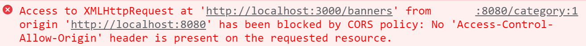

# 乐淘前端项目

## 1.项目搭建

### 1.目标

​       使用nuxt脚手架搭建前端项目

### 2.实现思路

1. 使用nuxt脚手架命令创建前端项目
2. cd 切换到项目目录 执行yarn命令安装项目依赖的包
3. 使用yarn dev 启动项目 

### 3.代码实现

```javascript
yarn create nuxt-app 项目名称
cd 项目名称
yarn dev
```

### 4.总结

使用yarn create nuxt-app 项目名称，注意：项目名称格式是英文，不要用关键字react  vue  redux等常用的包名

## 2.公共结构布局

### 1.目标

​     使用```vant``` 组件库完成乐淘前端项目公共布局结构

### 2.实现思路

1.  项目根目录创建```layouts/default.vue```文件，划分公共页面头部，主体，底部三部分, 
2.  在主体结构中，使用<Nuxt/>组件占位
3.  集成```vant ```组件到```nuxt```项目插件中
4.  参照```vant```官方使用头部和底部导航组件
5.  在pages目录中创建首页 分类 购物车 我的路由页面组件

### 3.代码实现

```layouts/default.vue```

```vue
<template>
  <!-- 项目公共布局文件 -->
  <div class="layout_home">
    <!-- 头部 -->
    <header>
      <van-nav-bar
        title="标题"
        @click-left="$router.go(-1)"
        left-text="返回"
        left-arrow
      >
        <template #right>
          <van-icon name="search" size="18" />
        </template>
      </van-nav-bar>
    </header>
    <!-- 主体 -->
    <main>
      <Nuxt />
    </main>
    <!-- 底部导航 -->
    <footer>
      <van-tabbar v-model="active">
        <van-tabbar-item icon="home-o" to="/">首页</van-tabbar-item>
        <van-tabbar-item icon="bag-o" to="/category">分类</van-tabbar-item>
        <van-tabbar-item icon="shopping-cart-o" to="/cart"
          >购物车</van-tabbar-item
        >
        <van-tabbar-item icon="friends-o" to="/my">我的</van-tabbar-item>
      </van-tabbar>
    </footer>
  </div>
</template>

<script>
export default {
  data() {
    return {
      active: 0,
    };
  },
};
</script>
```

### 4.总结

​      页面组件中，除了首页使用index.vue文件，其他页面建议使用路由名创建文件夹，里面创建对应的xxx.vue文件


## 3. 布局文件优化

### 1.目标

​    解决刷新页面，1.底部导航高亮还原问题  2.标题更新问题

### 2.实现思路

1. 在导航组件中设置name属性，使用this.route.name设置data中的active字段的值
2. data中声明title字段默认为空
3. 使用watch监听路由变化，重新设置标题
4. 在mounted方法中处理，页面刷新后的标题设置

### 3.代码实现

```plugins/default.vue```

```vue
<template>
  <!-- 项目公共布局文件 -->
  <div class="layout_home">
    <!-- 头部 -->
    <header>
      <van-nav-bar
        :title="title"
        @click-left="$router.go(-1)"
        left-text="返回"
        left-arrow
      >
        <template #right>
          <van-icon name="search" size="18" />
        </template>
      </van-nav-bar>
    </header>
    <!-- 主体 -->
    <main>
      <Nuxt />
    </main>
    <!-- 底部导航 -->
    <footer>
      <van-tabbar v-model="active">
        <van-tabbar-item name="index" icon="home-o" to="/"
          >首页</van-tabbar-item
        >
        <van-tabbar-item name="category" icon="bag-o" to="/category"
          >分类</van-tabbar-item
        >
        <van-tabbar-item name="cart" icon="shopping-cart-o" to="/cart"
          >购物车</van-tabbar-item
        >
        <van-tabbar-item name="my" icon="friends-o" to="/my"
          >我的</van-tabbar-item
        >
      </van-tabbar>
    </footer>
  </div>
</template>

<script>
export default {
  data() {
    return {
      active: this.$route.name, // 底部高亮
      title: "", // 顶部标题
    };
  },
  methods: {
    // 页面刷新后设置标题
    refreshHandle() {
      this.title = {
        index: "乐淘-首页",
        category: "乐淘-分类页",
        cart: "乐淘-购物车",
        my: "乐淘-我的",
      }[this.$route.name];
    },
  },
  mounted() {
    // 页面刷新后会触发mounted方法 所以我们需要重新设置标题
    this.refreshHandle();
  },
  // 刷新页面，路由不更改就不会触发watch方法 导致刷新页面 标题始终是乐淘-首页
  watch: {
    // 路由切换后 设置标题
    $route() {
        this.refreshHandle();
    },
  },
};
</script>
```


### 4.总结

  watch监听路由变化时设置标题，但是刷新路由，由于路由没有发生变化，所有不会触发watch，从而标题不会设置设置， 使用mounted方法重新设置标题解决

```asyncData```方法只能用在页面组件，所以不能在布局文件中使用```asyncData```方法设置标题


## 4.前端解决跨域问题



### 1.目标

​       首页调用轮播图接口读取数据，配置前端项目启动ip和端口。

### 2.实现思路

1.  使用yarn安装```$nuxtjs/axio```s模块，并在nuxt.config.js中model中做配置
2. 在nuxt.config.js中配置```serevr```修改前端项目启动的```ip```和端口

3.  在```pages/index.vue```中使用```asyncData``` 函数中的参数```$axios```调用后端轮播图接口，并在控制台中打印返回的数据

4.  安装```@nuxtjs/proxy ``` 模块解决跨域问题

### 3.代码实现

nuxt.config.js

```javascript
export default {
 
  // Modules: https://go.nuxtjs.dev/config-modules
  modules: [
    '@nuxtjs/axios',
    '@nuxtjs/proxy'
  ],
  axios: {
    proxy: true
    // 自动加前缀
    // prefix:'/api'
  },
  proxy: {
    '/api': {
      target: 'http://localhost:3000',
      pathRewrite: {
        '^/api': '/'
      }
    }
  },
  server: {
    host: 'localhost',
    port: 8080
  }
}
```

pages/index.vue

```vue
<template>
 <div class="home">
    <!-- 1.轮播图 -->
    <!-- 2.宫格 -->
    <!-- 3.活动 -->
    <!-- 4.品牌 -->
    <!-- 5.运动 -->
 </div>
</template>

<script>
export default {
   async asyncData ({$axios}) {
     const {swipperList} = await $axios.$get('/api/banners');
     console.log(swipperList);
     return {
        swipperList
     }
   }
}
</script>

```

#### 4.总结

​     什么是跨域？ 协议，域名，端口，有任意一个不同就是跨域, 解决方案：1. 前端配置代理解决    2.后端解决跨域问题


## 5.服务端解决跨域问题

### 1.目标

  服务端使用```koa-cors```中间件解决跨域问题

### 2.实现思路

1. 使用yarn安装```koa-cors```包
2. 在服务端app.js 中引入```koa-cors```
3. 使用```app.use(cors()) ```注册中间件

### 3.代码实现

```app.js```

```javascript
const Koa = require('koa')  // KOA 包
const app = new Koa()  // 创建app服务
const cors = require('koa-cors');

// 启动dotenv
require('dotenv').config()

app.use(cors())

module.exports = app

```

### 4.总结

  跨域解决方案有很多，前端可以配置代理，或者使用```nginx```代理都可以，后端也可以解决跨域问题，一般在开发中是前端解决跨域问题.


## 6.首页轮播图模块

### 1.目标

实现首页轮播图模块功能

### 2.实现思路

1. 使用vant组件库中的轮播图组件完成轮播图静态页面效果
2. 封装轮播图组件到components目录
3. 父子通信，完成轮播图交互功能呢
4. 在前端项目中的static目录存放静态图片文件

### 3.代码实现

```pages/index.vue```

```vue
<template>
 <div class="home">
    <!-- 1.轮播图 -->
    <Carousel :banners="swipperList"/>
    <!-- 2.宫格 -->
    <!-- 3.活动 -->
    <!-- 4.品牌 -->
    <!-- 5.运动 -->
 </div>
</template>

<script>
export default {
   async asyncData ({$axios}) {
     const {swipperList} = await $axios.$get('/banners');
     console.log(swipperList);
     return {
        swipperList
     }
   }
}
</script>

```

### 4.总结

## 7.首页其他组件的封装

### 1.目标

  完成宫格组件，活动组件，品牌组件，运动组件的封装

### 2.实现思路

1. 在components目录下创建```IndexGridList IndexActive IndexBrand  IndexSports```四个组件
2. 在组件中粘贴一下静态页面
3. 在页面中使用组件

### 3.代码实现

```components/IndexGridList.vue```

```vue
<template>
  <div class="grid">
    <van-grid :border="false" :column-num="3">
      <van-grid-item>
        <van-image src="https://img01.yzcdn.cn/vant/apple-2.jpg" />
      </van-grid-item>
      <van-grid-item>
        <van-image src="https://img01.yzcdn.cn/vant/apple-3.jpg" />
      </van-grid-item>
      <van-grid-item>
        <van-image src="https://img01.yzcdn.cn/vant/apple-1.jpg" />
      </van-grid-item>
      <van-grid-item>
        <van-image src="https://img01.yzcdn.cn/vant/apple-2.jpg" />
      </van-grid-item>
      <van-grid-item>
        <van-image src="https://img01.yzcdn.cn/vant/apple-3.jpg" />
      </van-grid-item> 
    </van-grid>
  </div>
</template>

<script>
export default {
  props:['gridList']
};
</script>
```

```components/IndexActive.vue```

```vue
<template>
  <div class="cz_active">
    <a href="#">
      
      
    </a>
    <a href="#">
      
    </a>
    <a href="#">
      
      
    </a>
  </div>
</template>

<style scoped>
.cz_active {
  border-top: 1px solid #ccc;
  margin-top: 15px;
  padding: 0 10px;
}
.cz_active a:nth-child(2n + 1) {
  width: 67.1%;
  float: left;
}
.cz_active a:nth-child(2n + 1) img {
  width: 50%;
  float: left;
}
.cz_active a:nth-child(2) {
  width: 32.9%;
  float: right;
}
.cz_active a:nth-child(2) img {
  width: 100%;
}
</style>
```

```components/IndexBrand.vue```

```vue
<template>
  <div class="cz_brand">
    
    <ul>
      <li>
        <a href="#">
          
        </a>
      </li>
      <li>
        <a href="#">
          
        </a>
      </li>
      <li>
        <a href="#">
          
        </a>
      </li>
      <li>
        <a href="#">
          
        </a>
      </li>
      <li>
        <a href="#">
          
        </a>
      </li>
      <li>
        <a href="#">
          
        </a>
      </li>
      <li>
        <a href="#">
          
        </a>
      </li>
      <li>
        <a href="#">
          
        </a>
      </li>
    </ul>
  </div>
</template>

<style scoped>
.cz_brand {
  padding: 0 10px;
}
.cz_brand > img {
  width: 100%;
}

.cz_brand ul {
  list-style: none;
  margin: 0;
  padding: 0;
}
.cz_brand ul li {
  width: 25%;
  float: left;
}
.cz_brand ul li a {
  display: block;
}
.cz_brand ul li a img {
  width: 100%;
}
</style>
```

```components/IndexSport.vue```

```vue
<template>
  <div class="cz_live">
    
    <div class="mui-clearfix">
      <a href="#" class="cz_product">
        <div class="box">
          
          <p class="name">adidas阿迪达斯 男式 场下休闲篮球鞋S83700</p>
          <p>
            <span class="price">¥560.00</span
            ><span class="oldPrice">¥888.00</span>
          </p>
          <button class="button">立即购买</button>
        </div>
      </a>
      <a href="#" class="cz_product">
        <div class="box">
          
          <p class="name">adidas阿迪达斯 男式 场下休闲篮球鞋S83700</p>
          <p>
            <span class="price">¥560.00</span
            ><span class="oldPrice">¥888.00</span>
          </p>
          <button class="button">立即购买</button>
        </div>
      </a>
      <a href="#" class="cz_product">
        <div class="box">
          
          <p class="name">adidas阿迪达斯 男式 场下休闲篮球鞋S83700</p>
          <p>
            <span class="price">¥560.00</span
            ><span class="oldPrice">¥888.00</span>
          </p>
          <button class="button">立即购买</button>
        </div>
      </a>
      <a href="#" class="cz_product">
        <div class="box">
          
          <p class="name">adidas阿迪达斯 男式 场下休闲篮球鞋S83700</p>
          <p>
            <span class="price">¥560.00</span
            ><span class="oldPrice">¥888.00</span>
          </p>
          <button class="button">立即购买</button>
        </div>
      </a>
    </div>
  </div>
</template>
<style scoped>
.cz_live {
  padding: 0 10px;
  margin-top: 10px;
  overflow: hidden;
  padding-bottom: 100px;
}
.cz_live > img {
  width: 100%;
}

.mui-clearfix:after {
  content: "020";
  display: block;
  height: 0;
  clear: both;
  visibility: hidden;
}

.mui-clearfix {
  /* 触发 hasLayout */
  zoom: 1;
}

.cz_product {
  float: left;
  width: 50%;
  padding: 0 5px;
  margin-bottom: 10px;
  box-sizing: border-box;
}
.cz_product .box {
  width: 100%;
  box-shadow: 0 0 5px #ccc;
  text-align: center;
  padding: 10px 0;
}
.cz_product .box img {
  width: 100%;
}
.cz_product .box .name {
  padding: 0 10px;
  height: 36px;
  line-height: 18px;
  overflow: hidden;
}
.cz_product .box .price {
  font-size: 12px;
  color: #f30;
  margin-right: 10px;
}
.cz_product .box .oldPrice {
  font-size: 12px;
  color: #ccc;
  text-decoration: line-through;
}
.cz_product .box .button {
  background: #006699;
  color: #fff;
}
</style>
```

#### 4.总结

​     对于公共可复用组件要单独封装到components目录下的功能组件，方便组件复用。


## 8.首页组件交互

### 1.目标

​     调用后端接口，使用父子组件通信，完成首页组件的动态数据交互。

### 2.实现思路

1. 在页面组件中的```asyncData```方法中解构出```$axios```方法调用后端接口，拿数据
2. 使用父子组件通信技术完成首页复用组件的交互

### 3.代码实现

pages/index.vue

```vue
<template>
 <div class="home">
    <!-- 1.轮播图 -->
    <IndexCarousel :banners="swipperList"/>
    <!-- 2.宫格 -->
    <IndexGridList :gridlist="gridlist" />
    <!-- 3.活动 -->
    <IndexActive />
    <!-- 4.品牌 -->
    <IndexBrand />
    <!-- 5.运动 -->
    <IndexSport :sports="sports"/>
 </div>
</template>

<script>
export default {
   async asyncData ({$axios}) {
     const {swipperList} = await $axios.$get('/banners');
     const {gridlist} = await $axios.$get('/gridlist');
     const {sports} = await $axios.$get('/sports');
     
     return {
        swipperList,
        gridlist,
        sports
     }
   }
}
</script>
```

```components/IndexGirdList.vue```

```vue
<template>
  <div class="grid">
    <van-grid :border="false" :column-num="3">
      <van-grid-item v-for="item in gridlist" :key="item.id">
        <van-image :src="item.img_src" />
      </van-grid-item>
    </van-grid>
  </div>
</template>

<script>
export default {
  props:['gridlist']
};
</script>
```

```components/IndexSport.vue```

```vue
<template>
  <div class="cz_live">
    
    <div class="mui-clearfix">
      <a href="#" class="cz_product" v-for="item in sports" :key="item.id">
        <div class="box">
          
          <p class="name">{{ item.name }}</p>
          <p>
            <span class="price">¥{{item.price}}</span
            ><span class="oldPrice">¥{{ item.oldPrice }}</span>
          </p>
          <button class="button">立即购买</button>
        </div>
      </a>
    </div>
  </div>
</template>
<script>
export default {
  props:['sports']
}
</script>
<style scoped>
.cz_live {
  padding: 0 10px;
  margin-top: 10px;
  overflow: hidden;
  padding-bottom: 100px;
}
.cz_live > img {
  width: 100%;
}

.mui-clearfix:after {
  content: "020";
  display: block;
  height: 0;
  clear: both;
  visibility: hidden;
}

.mui-clearfix {
  /* 触发 hasLayout */
  zoom: 1;
}

.cz_product {
  float: left;
  width: 50%;
  padding: 0 5px;
  margin-bottom: 10px;
  box-sizing: border-box;
}
.cz_product .box {
  width: 100%;
  box-shadow: 0 0 5px #ccc;
  text-align: center;
  padding: 10px 0;
}
.cz_product .box img {
  width: 100%;
}
.cz_product .box .name {
  padding: 0 10px;
  height: 36px;
  line-height: 18px;
  overflow: hidden;
}
.cz_product .box .price {
  font-size: 12px;
  color: #f30;
  margin-right: 10px;
}
.cz_product .box .oldPrice {
  font-size: 12px;
  color: #ccc;
  text-decoration: line-through;
}
.cz_product .box .button {
  background: #006699;
  color: #fff;
}
</style>
```

#### 4.总结

​            使用props完成父子组件通信，<组件名  :属性 />  属性前面记得要：传递动态数据

## 9.```$nuxtjs/axios```二次封装

### 1. 请求和响应拦截

#### 1.目标

​     完成```@nuxtjs/axios```二次封装，完成请求，响应，错误拦截。

####  2.实现思路

1. 创建plugins/axios.js ， 设置请求，响应，错误拦截
2. 在store/index.js  导出state,用户token默认为空 表示用户未登录
3. 请求中拦截中读取store中的token，设置请求头Authorization
4. 在响应拦截中，影响状态码错误，使用```vant```组件中Toast组件提示用户
5. 在错误拦截中，如果http状态码为401，则重定向到登录页面
6. 封装http错误状态码，给错误拦截使用
7. 在nuxt.config.js中plugins配置中完成插件的注册

#### 3.代码实现

````plugins/axios/httpcode.js```

```javascript
export const httpcode = {
    // http状态吗
    400: '请求错误(400)',
    401: '未授权，请重新登录(401)',
    403: '未登录，请重新登录(401)',
    404: 'Not Found 请求出错(404)',
    412: '未找到有效session',
    408: '请求超时(408)',
    500: '服务器错误(500)',
    501: '服务未实现(501)',
    502: '网络错误(502)',
    503: '服务不可用(503)',
    504: '网络超时(504)',
    505: 'HTTP版本不受支持(505)'
}
```


```plugins/axios/index.js```

```javascript
import { httpcode } from './httpcode';
import { Toast } from 'vant'
export default function ({ $axios, redirect,store }) {
    // 请求拦截
    $axios.onRequest(config => {
      //token验证
      if (store.state.token) {
        //  设置请求头的token, 用于身份验证
        $axios.setHeader('Authorization', `Bearer ${store.state.token}`);
      } 
      return config;
    })

    // 响应拦截
    $axios.onResponse(response => {
        // console.log(response,'response');
        const { status, msg} = response.data;
        if (status !== 200) {
          Toast(msg);
        }
    });
  
    // 错误拦截
    $axios.onError(error => {
      const code = parseInt(error.response && error.response.status)
      // 弹框提示
      Toast(httpcode[code]);
      if (code === 404) {
        redirect('/404')
      } else if (code == 401) {
        redirect('/my/login');
      }
    })
  }
```

store/index.js

```javascript
export const state = ()=>{
    return {
        token:''
    }
}
```


#### 4.总结

   在请求拦截中读取store上的token并且设置请求头，在响应拦截中，遇到错误，弹框提示用户，在错误拦截中进行页面跳转，或者提示用户


### 2.请求方法封装

#### 1.目标

​       我们再使用```@nuxtjs/axios```模块调用接口时，分为get 和post请求等，还需要区分get和post的参数```get/delete的请求参数是params  post/post请求参数data```，所以需要进行二次封装

#### 2.实现思路

1. 在```plugins/axios/index.js``` 继续封装请求方法
2. 在```plugins/axios/index.js```  注入request
3. 在nuxt.config.js中的plugins注册插件
4. 在页面中```asyncData```方法中的参数中解构$request请求接口


#### 3.代码实现

```plugins/axios/index.js```

```javascript
import { httpcode } from './httpcode';
import { Toast } from 'vant'
export default function ({ $axios, redirect,store }, inject) {
    // 请求方法封装
    let requestMethods = {};

    ['get','post', 'delete', 'pust'].forEach(method =>{
       let paramsOrData = method == 'get' || method == 'delete' ? 'params' :'data';
       requestMethods[method] = function (url, data) {
          return $axios({
             method,
             url,
             [paramsOrData]:data
          })
       }
    });

    inject('request', requestMethods);

  }
```

nuxt.config.js

```javascript
  plugins: [
    '~/plugins/vant',
    '~/plugins/axios'
  ],
```


#### 4.总结

   请求方法不同，请求参数格式不同，对于不同的就是变化的，要进行二次封装.


### 3.请求方法封装优化

#### 1.目标

   ```@nuxtjs/axios模块支持  $axios.get  同样支持$axios.$get 区别是， $axios.$get拿到的数据少一层data```

#### 2.实现思路

1. 修改请求方法的封装，````把$axios.get请求换成$axios.$get请求```
2. 其他请求方法以此类推
3. 在页面中```asyncData```方法中的参数中解构$request请求接口

#### 3.代码实现

````plugins/axios/index.js```

```javascript
import { httpcode } from './httpcode';
import { Toast } from 'vant'
export default function ({ $axios, redirect,store }, inject) {
    // 请求方法封装
    let requestMethods = {};
    ['$get','$post', '$delete', '#put'].forEach(method =>{
       requestMethods[method] = function (url, data) {
          return $axios[method](
             url,
             data
          )
       }
    });

    inject('request', requestMethods);

  }
```

#### 4.总结

   使用$get $post请求，读取接口数据时，少一层data，代码书写更优雅，而且封装时无需考虑```params```参数还是data参数


### 4.请求```api```的封装

#### 1.目标

   前端项目中会有很多接口调用，对于接口地址，我们不应该散落到页面中，而是统一到一个文件方便管理，所以我们要对项目中的API进行封装

#### 2.实现思路

1. 创建plugins/api.js 插件
2. 在此插件中注入```api```完成项目中所有```api```的封装,此插件以来request插件
3. nuxt.config.js中的plugins中注入```api```插件
4. 在页面中```asyncData```方法中的参数中解构```$api``` 直接调用api


#### 3.代码实现

plugins/api.js

```javascript
export default function ({ app: { $request } }, inject) {
    inject('api', {
        /**
        * 首页宫格数据
        * @returns 
        */
        IndexGrid() {
            return $request.$get('/gridlist');
        },
        /**
         * 首页轮播图数据
         * @returns 
         */
        IndexBanners() {
            return $request.$get('/banners');
        },
        /**
         * 首页运动专区数据
         * @returns 
         */
        IndexSport() {
            return $request.$get('/sports');
        },
    });
}
```

nuxt.config.js

```javascript
  plugins: [
    '~/plugins/vant',
    '~/plugins/axios',
    '~/plugins/axios/api'
  ],
```

pages/index.vue

```vue
<template>
 <div class="home">
    <!-- 1.轮播图 -->
    <IndexCarousel :banners="swipperList"/>
    <!-- 2.宫格 -->
    <IndexGridList :gridlist="gridlist" />
    <!-- 3.活动 -->
    <IndexActive />
    <!-- 4.品牌 -->
    <IndexBrand />
    <!-- 5.运动 -->
    <IndexSport :sports="sports"/>
 </div>
</template>

<script>
export default {
   async asyncData ({$axios,app:{$api}}) {
       
     const { swipperList } = await $api.IndexBanners();
     const { gridlist } = await $api.IndexGrid();
     const { sports } = await $api.IndexSport();
     
     // 并发请求
     // const [{swipperList},{gridlist},{sports}] = await Promise.all([$api.IndexBanners(),await $api.IndexGrid(), await $api.IndexSport() ]);
       
     eturn {
        swipperList,
        gridlist,
        sports
     }
   }
}
</script>

```


## 10.分类页面

   效果演示


### 1.目标

​     完成分类页面交互

### 2.实现思路

1. 使用```vant```中```TreeSelect```分类组件完成静态页面
2. 调用一级分类和二级分类接口,按照```TreeSelect```组件对一级分类数据格式要求处理一级分类数据
3. 参照vantage组件官方文档，给一级分类绑定```click-nav```事件，点击一级分类加载二级分类
4. 点击一级分类时，使用```this.$router.replace```替换```url```地址,带上当前点击项的索引
5. 当页面刷新时在```asyncData```方法的参数中解构出query读取参数, 给一级分类选中项active赋值，并记载对应的二级分类接口

### 3.代码实现

pages/category/index.vue

```vue
<template>
  <div class="category">
    <van-tree-select
      height="100vw"
      :items="oneCategoryList"
      :main-active-index.sync="active"
      @click-nav="categoryHandle"
    >
      <template #content>
        <div v-for="item in twoCategory" :key="item.id" class="cate_item">
          <van-image  width="4rem" :src="item.brandLogo" />
          <p>{{ item.brandName }}</p>
        </div>
      </template>
    </van-tree-select>
  </div>
</template>

<script>
export default {
  data() {
    return {
      // active: 0,
    };
  },
  methods: {
   async categoryHandle(index) {
      // 地址栏中纪录点击的一级列表选项
      this.$router.replace(`category?active=${index}`);
      // 根据选中的一级分类id加载二级分类, 默认第一个一级分类是选中
      let { twoCategory } = await this.$api.TwoCategory(
        this.oneCategoryList[index]["id"]
      );
      this.twoCategory = twoCategory;
    },
  },
  async asyncData({ $api, query }) {
    let active = query.active ||  0;
    // 记载一级分类
    let { oneCategoryList } = await $api.OneCategory();
    // 处理一级分类数据
    oneCategoryList = oneCategoryList.map((item) => {
      return {
        id: item.id,
        text: item.categoryName,
      };
    });
    // 根据选中的一级分类id加载二级分类, 默认第一个一级分类是选中
    let { twoCategory } = await $api.TwoCategory(oneCategoryList[active]["id"]);
    return {
      active,
      oneCategoryList,
      twoCategory,
    };
  },
};
</script>

<style scoped>
.cate_item {
  float: left;
  text-align: center;
}
</style>
```

### 4.总结

在使用```vant```中的组件时，需要仔细阅读官方文档的```api```，复制粘贴后按照格式，调整数据或者事件绑定。

## 11.loading组件

###  1.目标

​    页面切换时，需要加载接口，接口记载过程中，页面没有数据，显示空白，为了提升用户体验所以需要设置loading效果，页面显示完毕，需要停止loding

###  2.实现思路

1.   在```components/Loading.vue``` 创建Loading组件 
2.   使用```vant```中van-overlay遮罩组件和van-loading显示加载样式
3.   在Loading组件中设置默认加载loading状态为false，在methods中定义start 和 finish两个方法显示和隐藏loading
4.   在nuxt.config.js中注册Loading组件


### 3.实现思路

 components/Loading.vue

```vue
<template>
  <van-overlay :show="loading"  class="loading" z-index="10">
    <van-loading color="#fff" v-show="loading"  :vertical="true">加载中...</van-loading>
  </van-overlay>
</template>

<script>
export default {
  data() {
    return {
      loading: false,
    };
  },
  methods: {
    start() {
      console.log(1);
      this.loading = true;
    },
    finish() {
        console.log(2);
      this.loading = false;
    },
  },
};
</script>

<style scoped>
.loading {
  display: flex;
  align-items: center;
  justify-content: center;
  height: 100%;
}
</style>
```

nuxt.config.js

```javascript
loading:'~/components/Loading.vue',
```

### 4.总结

 在```nuxt```项目中，只需要配置Loading组件中即可，实现全局loading效果，无需在```axios```中进行封装,只需要按照配置做，```nuxt```帮你自动实现loading

## 12.404页面

### 1.目标

完成404页面开发，当输入一个不存在的路由时，应该友好的提示用户页面不存在，而不是显示一堆错误信息.

### 2.实现思路

1.  在pages目录下创建_.vue
2.  使用```vant```中的van-empty组件显示页面不存在
3. 地址栏中输入不存在的url，刷新页面验证。

### 3.代码实现

pages目录下```_.vue```

```vue
<template>
  <van-empty description="页面不存在" />
</template>

<script>
export default {

}
</script>
```

### 4.总结

   404页面的作用就是提升用户体验


##       13.会员模块

1. 会员注册模块
2. 会员登录模块
3. 会员中心模块

### 1.会员注册模块

####          1.会员注册静态页

##### 1.目标

  使用vant表单组件库实现注册静态页面

##### 2.实现思路

1. 使用```vant```中的van-form表单组件完成用户名，密码，手机号，验证码样式
2. 使用```vant```中的van-row组件完成会员协议样式
3. 在data中定义表单所需数据

##### 3.代码实现

```vue
<template>
  <div class="register">
    <van-form @submit="onSubmit">
      <!-- 用户名 -->
      <van-field
        v-model="username"
        name="username"
        label="用户名"
        placeholder="用户名"
        :rules="[{ required: true, message: '请填写用户名' }]"
      />
      <!-- 密码 -->
      <van-field
        v-model="password"
        type="password"
        name="password"
        label="密码"
        placeholder="密码"
        :rules="[{ required: true, message: '请填写密码' }]"
      />
      <!-- 重复密码 -->
      <van-field
        v-model="repeatPassword"
        type="password"
        name="repeatPassword"
        label="确认密码"
        placeholder="确认密码"
        :rules="[{ required: true, message: '两次密码不一致，请重新填写' }]"
      />
      <!-- 手机号 -->
      <van-field
        v-model="mobile"
        name="mobile"
        label="手机号"
        placeholder="手机号"
        :rules="[{ required: true, message: '请填写用户名' }]"
      />
      <!-- 验证码 -->
      <van-field
        v-model="smscode"
        name="smscode"
        label="验证码"
        placeholder="验证码"
        :rules="[{ required: true, message: '请填写用户名' }]"
      >
        <template #button>
            <van-button type="primary" size="small" >发送短信验证码</van-button>
        </template>
      </van-field>
      <div style="margin: 16px">
        <van-button round block type="info" native-type="submit"
          >提交</van-button
        >
      </div>
    </van-form>
    <!-- 用户需知 -->
    <van-row type="flex" justify="space-around">
      <van-col span="12">
          <van-checkbox v-model="isagree">我同意《会员服务协议》</van-checkbox>
      </van-col>
      <van-col span="6">
          <NuxtLink to="/my/login">立即登录</NuxtLink>
      </van-col>
    </van-row>
  </div>
</template>

<script>
export default {
  data() {
    return {
      username: "",
      password: "",
      repeatPassword: "",
      mobile: "",
      smscode: "",
      isagree:false
    };
  },
  methods: {
    onSubmit(values) {
       console.log("submit", values);
    },
  },
};
</script>
```

##### 4.总结

  仔细遇到vant等组件库中组件的使用，按照规则进行使用。

####       2.表单校验功能

##### 1.目标

   实现会员注册页的表单校验功能

##### 2.实现思路

1. 项目根目录创建utils/index.js
2. 导出校验表单校验对象，该对象中包含用户名，密码，手机号，验证码的校验函数
3. 在注册页面中导入并在注册事件触发时，调用表单校验方法完成表单校验
4. 如果校验不通过，使用```vant```中的Toast组件弹框提示错误信息

##### 3.代码实现

utils/index.js

```javascript
export const verify = {
     // 验证用户名 长度大于4位 小于20位 
     username (username) {
        if (!username) {
             return '用户名不能为空,请重新输入';
        } 
        if (!/^[a-zA-Z0-9]{4,20}$/.test(username.trim())) {
            return "用户名长度必须是大于4位或者小于20位";
        }
     },
     //验证密码  
     password (password,repeatPassword) {
        if (!password) {
            return '用户密码不能为空,请重新输入' ;
        } 
        if (!/^[a-zA-Z0-9]{6,20}$/.test(password.trim())) {
            return '用户密码长度在6到20位';
        }
        if (password !== repeatPassword) {
            return "两次输入的密码不一致, 重新输入";
        }
     },
     // 验证手机号 
     mobile (moble) {
        if (!moble) {
            return "手机号不能为空，请重新输入";
        } 
        if (!/^1(3\d|4[5-9]|5[0-35-9]|6[2567]|7[0-8]|8\d|9[0-35-9])\d{8}$/.test(moble)) {
           return "手机号格式不正确,请重新输入手机号";
        }
     }
}
```

```pages/my/register.vue```

```vue
<template>
  <div class="register">
    <van-form @submit="onSubmit">
      <!-- 用户名 -->
      <van-field
        v-model="username"
        name="username"
        label="用户名"
        placeholder="用户名"
        :rules="[{ required: true, message: '请填写用户名' }]"
      />
      <!-- 密码 -->
      <van-field
        v-model="password"
        type="password"
        name="password"
        label="密码"
        placeholder="密码"
        :rules="[{ required: true, message: '请填写密码' }]"
      />
      <!-- 重复密码 -->
      <van-field
        v-model="repeatPassword"
        type="password"
        name="repeatPassword"
        label="确认密码"
        placeholder="确认密码"
        :rules="[{ required: true, message: '两次密码不一致，请重新填写' }]"
      />
      <!-- 手机号 -->
      <van-field
        v-model="mobile"
        name="mobile"
        label="手机号"
        placeholder="手机号"
        :rules="[{ required: true, message: '请填写用户名' }]"
      />
      <!-- 验证码 -->
      <van-field
        v-model="smscode"
        name="smscode"
        label="验证码"
        placeholder="验证码"
        :rules="[{ required: true, message: '请填写用户名' }]"
      >
        <template #button>
            <van-button type="primary" size="small" >发送短信验证码</van-button>
        </template>
      </van-field>
      <div style="margin: 16px">
        <van-button round block type="info" native-type="submit"
          >提交</van-button
        >
      </div>
    </van-form>
    <!-- 用户需知 -->
    <van-row type="flex" justify="space-around">
      <van-col span="12">
          <van-checkbox v-model="isagree">我同意《会员服务协议》</van-checkbox>
      </van-col>
      <van-col span="6">
          <NuxtLink to="/my/login">立即登录</NuxtLink>
      </van-col>
    </van-row>
  </div>
</template>

<script>
import { verify } from "~/utils";
import { Toast } from "vant";

export default {
  data() {
    return {
      username: "",
      password: "",
      repeatPassword: "",
      mobile: "",
      smscode: "",
      isagree:false
    };
  },
  methods: {
    onSubmit(values) {
      if (!this.isagree) {
          Toast('请阅读会员协议,同意后才可注册~');
          return;
      }
      // 验证信息
      const msg =
        verify.username(this.username) ||
        verify.password(this.password, this.repeatPassword) ||
        verify.mobile(this.mobile);

      //表单校验
      if (msg) {
        Toast(msg);
        return;
      }
      console.log("submit", values);
    },
  },
};
</script>
```

##### 4.总结

​    表单的作用就是收集用户数据，进行存入数据库， 开发中遇到表单第一要想到的是表单校验，防止不合法数据存入数据库。

#### 3.发送短信验证功能

#####    1.目标

​      调用后端发送短信接口，完成发送短信功能

#####    2.实现思路

1.  data上定义```smscodeserver```字段保存短信接口返回的短信，用于和用户输入的短信验证码比对
2. 避免用户重复调短信接口，调用一次发送短信后，开启定时器30内能禁用发送短信按钮
3.  data上定义timer字段，用于销毁定时器。
4.  data上定义```isDisable```字段，决定发送按钮的禁用状态
5. 给发送短信按钮绑定点击事件，验证用户是否输入手机号，没有弹框提示，否则放行
6. 调用发送短信接口，获取验证码
7. 拿到接口验证码跟用户输入的验证码进行比对，相同则进行下一步注册功能

#####   3.代码实现

​    pages/my/register.vue

```vue
<template>
  <div class="register">
    <van-form @submit="onSubmit">
      <!-- 用户名 -->
      <van-field
        v-model="username"
        name="username"
        label="用户名"
        placeholder="用户名"
        :rules="[{ required: true, message: '请填写用户名' }]"
      />
      <!-- 密码 -->
      <van-field
        v-model="password"
        type="password"
        name="password"
        label="密码"
        placeholder="密码"
        :rules="[{ required: true, message: '请填写密码' }]"
      />
      <!-- 重复密码 -->
      <van-field
        v-model="repeatPassword"
        type="password"
        name="repeatPassword"
        label="确认密码"
        placeholder="确认密码"
        :rules="[{ required: true, message: '两次密码不一致，请重新填写' }]"
      />
      <!-- 手机号 -->
      <van-field
        v-model="mobile"
        name="mobile"
        label="手机号"
        placeholder="手机号"
        :rules="[{ required: true, message: '请填写用户名' }]"
      />
      <!-- 验证码 -->
      <van-field
        v-model="smscode"
        name="smscode"
        label="验证码"
        placeholder="验证码"
        :rules="[{ required: true, message: '请填写用户名' }]"
      >
        <template #button>
          <van-button
            type="primary"
            size="small"
            :disabled="isDisabled"
            @click="sendsmsHandle"
            >{{ sendcodemsg }}</van-button
          >
        </template>
      </van-field>
      <div style="margin: 16px">
        <van-button round block type="info" native-type="submit"
          >提交</van-button
        >
      </div>
    </van-form>
    <!-- 用户需知 -->
    <van-row type="flex" justify="space-around">
      <van-col span="12">
        <van-checkbox v-model="isagree">我同意《会员服务协议》</van-checkbox>
      </van-col>
      <van-col span="6">
        <NuxtLink to="/my/login">立即登录</NuxtLink>
      </van-col>
    </van-row>
  </div>
</template>

<script>
import { verify } from "~/utils";
import { Toast } from "vant";

export default {
  data() {
    return {
      username: "",
      password: "",
      repeatPassword: "",
      mobile: "",
      smscode: "",
      smscodeServer: "",
      isagree: false,
      isDisabled: false, // 发送短信验证码是否可用
      sendcodemsg: "发送短信",
      timer: null,
    };
  },
  methods: {
    // 发送短信
    async sendsmsHandle() {
      // 验证用户输入的手机号
      const msg = verify.mobile(this.mobile);
      // 用户是否输入手机号
      if (msg) {
        Toast(msg);
        return;
      }
      // 禁用发送按钮
      this.isDisabled = true;
      let time = 30;
      // 发送短信验证码
      const { data } = await this.$api.SendSms(this.mobile);
      this.smscodeServer = data;
      this.timer = setInterval(() => {
        time--;
        if (time == 0) {
          this.isDisabled = false;
        }
        this.sendcodemsg = `倒计时:${time}`;
      }, 1000);
    },
    onSubmit(values) {
      if (!this.isagree) {
        Toast("请阅读会员协议,同意后才可注册~");
        return;
      }
      // 验证信息
      const msg =
        verify.username(this.username) ||
        verify.password(this.password, this.repeatPassword) ||
        verify.mobile(this.mobile);

      //表单校验
      if (msg) {
        Toast(msg);
        return;
      }
      // 验证短信是否输入正确
      if (this.smscode !== this.smscodeServer) {
        Toast("短信验证码有误，请重新输入");
        return;
      }
      //销毁定时器   
      this.timer = null;
      console.log("submit", values);
    },
  },
};
</script>
```


##### 4.总结

​     遇到表单相关操作，一定会有表单校验，校验不通过退出程序，否则放行，页面中资源占用比如定时器，最终要销毁。


#### 4.注册功能

##### 1.目标

   调用注册接口完成注册交互功能

##### 2.实现思路

1. 给注册按钮绑定点击事件
2. 调用注册接口
3. 注册成功后存储用户信息到```vuex```并跳转登录页面

##### 3.代码实现

```vue
<template>
  <div class="register">
    <van-form @submit="onSubmit">
      <!-- 用户名 -->
      <van-field
        v-model="username"
        name="username"
        label="用户名"
        placeholder="用户名"
        :rules="[{ required: true, message: '请填写用户名' }]"
      />
      <!-- 密码 -->
      <van-field
        v-model="password"
        type="password"
        name="password"
        label="密码"
        placeholder="密码"
        :rules="[{ required: true, message: '请填写密码' }]"
      />
      <!-- 重复密码 -->
      <van-field
        v-model="repeatPassword"
        type="password"
        name="repeatPassword"
        label="确认密码"
        placeholder="确认密码"
        :rules="[{ required: true, message: '两次密码不一致，请重新填写' }]"
      />
      <!-- 手机号 -->
      <van-field
        v-model="mobile"
        name="mobile"
        label="手机号"
        placeholder="手机号"
        :rules="[{ required: true, message: '请填写用户名' }]"
      />
      <!-- 验证码 -->
      <van-field
        v-model="smscode"
        name="smscode"
        label="验证码"
        placeholder="验证码"
        :rules="[{ required: true, message: '请填写用户名' }]"
      >
        <template #button>
          <van-button
            type="primary"
            size="small"
            :disabled="isDisabled"
            @click="sendsmsHandle"
            >{{ sendcodemsg }}</van-button
          >
        </template>
      </van-field>
      <div style="margin: 16px">
        <van-button round block type="info" native-type="submit"
          >提交</van-button
        >
      </div>
    </van-form>
    <!-- 用户需知 -->
    <van-row type="flex" justify="space-around">
      <van-col span="12">
        <van-checkbox v-model="isagree">我同意《会员服务协议》</van-checkbox>
      </van-col>
      <van-col span="6">
        <NuxtLink to="/my/login">立即登录</NuxtLink>
      </van-col>
    </van-row>
  </div>
</template>

<script>
import { verify } from "~/utils";
import { Toast } from "vant";
import { mapMutations } from 'vuex';
export default {
  data() {
    return {
      username: "",
      password: "",
      repeatPassword: "",
      mobile: "",
      smscode: "",
      smscodeServer: "",
      isagree: false,
      isDisabled: false, // 发送短信验证码是否可用
      sendcodemsg: "发送短信",
      timer: null,
    };
  },
  methods: {
    ...mapMutations(['updateUserInfo']),
    // 发送短信
    async sendsmsHandle() {
      // 验证用户输入的手机号
      const msg = verify.mobile(this.mobile);
      // 用户是否输入手机号
      if (msg) {
        Toast(msg);
        return;
      }
      // 禁用发送按钮
      this.isDisabled = true;
      let time = 30;
      // 发送短信验证码
      const { data } = await this.$api.SendSms(this.mobile);
      this.smscodeServer = data;
      this.timer = setInterval(() => {
        time--;
        if (time == 0) {
          this.isDisabled = false;
        }
        this.sendcodemsg = `倒计时:${time}`;
      }, 1000);
    },
    async onSubmit(values) {
      if (!this.isagree) {
        Toast("请阅读会员协议,同意后才可注册~");
        return;
      }
      // 验证信息
      const msg =
        verify.username(this.username) ||
        verify.password(this.password, this.repeatPassword) ||
        verify.mobile(this.mobile);

      //表单校验
      if (msg) {
        Toast(msg);
        return;
      }
      // 验证短信是否输入正确
      if (this.smscode !== this.smscodeServer) {
        Toast("短信验证码有误，请重新输入");
        return;
      }
      //销毁定时器   
      this.timer = null;
      const {status,message} = await this.$api.Register({
          ...values
      });
      if (status == 200) {
          // 存储用户信息到vuex
          this.updateUserInfo(userInfo);
          this.$router.push('/my/login')
      }
    },
  },
};
</script>
```

##### 4.总结

 ```vant```中表单提交方法```onSubmit```中的第一个参数，就是表单中所有的提交数据对象，可以直接作为请求参数。


### 2.登录模块

#### 1.登录静态页

##### 1.目标

  完成登录静态页面开发

##### 2.实现思路

1. 使用```vant```中van-form组件完成登录页面静态页面

##### 3.代码实现

pages/my/login.vue

```vue
   <template>
     <div class="login">
       <van-form @submit="onSubmit">
         <van-field
           v-model="username"
           name="username"
           label="用户名"
           placeholder="用户名"
           :rules="[{ required: true, message: '请填写用户名' }]"
         />
         <van-field
           v-model="password"
           type="password"
           name="password"
           label="密码"
           placeholder="密码"
           :rules="[{ required: true, message: '请填写密码' }]"
         />
         <div style="margin: 16px">
           <van-button round block type="info" native-type="submit"
             >提交</van-button
           >
         </div>
       </van-form>
       <van-row type="flex" justify="space-between" class="license">
         <van-col span="6" offset="2">
           <NuxtLink to="/user/register">立即注册</NuxtLink>
         </van-col>
       </van-row>
     </div>
   </template>
   
   <script>
   export default {
     data() {
       return {
         username: "",
         password: "",
       };
     },
     methods: {
       async onSubmit(values) {
         console.log("submit", values);
       },
     },
   };
   </script>
   
   <style>
   </style>
```

##### 4.总结

​      严格按照```vant```官方文档，使用```vant```提供的组件.

#### 2.登录交互

#####  1.目标

​       实现用户登录交互功能

##### 2.实现思路

   1.登录按钮点击事件中参数就是用户登录的表单数据, 进行表单校验

2. 在```api```中新增登录接口，登录时先进行表单校验，不通过提示用户，否则进行下一步

          3.  在```vuex```中的mutations中定义修改token的方法， 用户登录成功之后，存储token，并且跳转到我的页面

##### 3.代码实现

​		store目录下index.js

```javascript
// 公共仓库
     export const state = () => {
          return {
              token:'',
              userInfo:{} // 用户信息
          }
     }
     
     export const mutations = {
         // 存储token
         setToken (state, token) {
             state.token = token;
         },
         // 存储用户信息
         setUserInfo (state, userInfo) {
             state.userInfo = userInfo;
         }
     }
```

```pages目录 login.vue```

```vue
    <template>
  <div class="login">
    <van-form @submit="onSubmit">
      <van-field
        v-model="username"
        name="username"
        label="用户名"
        placeholder="用户名"
        :rules="[{ required: true, message: '请填写用户名' }]"
      />
      <van-field
        v-model="password"
        type="password"
        name="password"
        label="密码"
        placeholder="密码"
        :rules="[{ required: true, message: '请填写密码' }]"
      />
      <div style="margin: 16px">
        <van-button round block type="info" native-type="submit"
          >提交</van-button
        >
      </div>
    </van-form>
  </div>
</template>

<script>
import { verify } from '~/utils';
import { Toast } from 'vant';
import { mapMutations } from 'vuex'
export default {
  data() {
    return {
      username: "",
      password: "",
    };
  },
  methods: {
    ...mapMutations(['updateToken']),
    async onSubmit(values) {
      // 表单验证
      let msg = verify.username(this.username) || verify.password(this.password);
      if (msg) {
         Toast(msg);
      }
      // 登录
     const {status, data:{token}} = await this.$api.Login(values);
     if (status == 200) {
        //设置token
        this.updateToken(token);
        this.$router.push('/my');
     }
    },
  },
};
</script>
```

##### 4.总结

​     遇到表单先校验，通过后提交数据


#### 3.用户Token持久化存储

##### 1.目标

 使用```nuxtServerInit``` 完成Token持久化存储

##### 2.实现思路

1.  在store/index.js中actions中使用```nuxtServerInit```函数结构出commit 和 ```req``
2.  安装js-cookie和cookirparser两个包
3.  在用户登录时使用```js-cookie```存储token，在```nuxtServerInit```函数中使用```cookieparser```结构出cookie中的token
4.  在nuxtServerInit函数中存储token
5.  刷新浏览器观察vuex中token状态

##### 3.代码实现

pages/my/login.vue

```vue
<template>
  <div class="login">
    <van-form @submit="onSubmit">
      <van-field
        v-model="username"
        name="username"
        label="用户名"
        placeholder="用户名"
        :rules="[{ required: true, message: '请填写用户名' }]"
      />
      <van-field
        v-model="password"
        type="password"
        name="password"
        label="密码"
        placeholder="密码"
        :rules="[{ required: true, message: '请填写密码' }]"
      />
      <div style="margin: 16px">
        <van-button round block type="info" native-type="submit"
          >提交</van-button
        >
      </div>
    </van-form>
  </div>
</template>

<script>
import Cookie from 'js-cookie';
import { verify } from '~/utils';
import { Toast } from 'vant';
import { mapMutations } from 'vuex'
export default {
  data() {
    return {
      username: "",
      password: "",
    };
  },
  methods: {
    ...mapMutations(['updateToken']),
    async onSubmit(values) {
      // 表单验证
      let msg = verify.username(this.username) || verify.password(this.password);
      if (msg) {
         Toast(msg);
      }
      // 登录
     const {status, data:{token}} = await this.$api.Login(values);
     if (status == 200) {
        //设置token
        this.updateToken(token);
        // 存储token到cookie
        Cookie.set('token',token)   
        this.$router.push('/my');
     }
    },
  },
};
</script>
```

store/index.js

```javascript
const cookieparser = require('cookieparser');
export const state = ()=>{
    return {
        token:''
    }
}

export const mutations = {
    updateToken (state,token) {
        state.token = token;
    }
};

export const actions = {
    //  只能使用在store/index.js中的actoins中
    nuxtServerInit({commit}, {req}){
        let token = '';
        if (req.headers.cookie) {
            let parserd = cookieparser.parse(req.headers.cookie);
            token = parserd.token;
            console.log(token,'token');
        }
        commit('updateToken', token);
    }
}
```

##### 4.总结

1. 用户登录成功后，把token存入cookie，```nuxtServerInit``` 只运行在服务端, 参数2可以解构出请求对象，从而读取客户端的cookie 

2. 只会在项目初始化执行一次，或者刷新页面时才会执行

### 3.会员中心

#### 1.目标

完成会员中心模块

#### 2.实现思路

1.  从```vuex```中导入```mapstate```方法
2. 在computed中使用```mapstate```，映射state的```userInfo```属性
3.  给退出登录绑定点击事件，清除token,清除cookie

#### 3.代码实现

```vue
<template>
  <div class="register">
    <van-form @submit="onSubmit">
      <!-- 用户名 -->
      <van-field
        v-model="username"
        name="username"
        label="用户名"
        placeholder="用户名"
        :rules="[{ required: true, message: '请填写用户名' }]"
      />
      <!-- 密码 -->
      <van-field
        v-model="password"
        type="password"
        name="password"
        label="密码"
        placeholder="密码"
        :rules="[{ required: true, message: '请填写密码' }]"
      />
      <!-- 重复密码 -->
      <van-field
        v-model="repeatPassword"
        type="password"
        name="repeatPassword"
        label="确认密码"
        placeholder="确认密码"
        :rules="[{ required: true, message: '两次密码不一致，请重新填写' }]"
      />
      <!-- 手机号 -->
      <van-field
        v-model="mobile"
        name="mobile"
        label="手机号"
        placeholder="手机号"
        :rules="[{ required: true, message: '请填写用户名' }]"
      />
      <!-- 验证码 -->
      <van-field
        v-model="smscode"
        name="smscode"
        label="验证码"
        placeholder="验证码"
        :rules="[{ required: true, message: '请填写用户名' }]"
      >
        <template #button>
          <van-button
            type="primary"
            size="small"
            :disabled="isDisabled"
            @click="sendsmsHandle"
            >{{ sendcodemsg }}</van-button
          >
        </template>
      </van-field>
      <div style="margin: 16px">
        <van-button round block type="info" native-type="submit"
          >提交</van-button
        >
      </div>
    </van-form>
    <!-- 用户需知 -->
    <van-row type="flex" justify="space-around">
      <van-col span="12">
        <van-checkbox v-model="isagree">我同意《会员服务协议》</van-checkbox>
      </van-col>
      <van-col span="6">
        <NuxtLink to="/my/login">立即登录</NuxtLink>
      </van-col>
    </van-row>
  </div>
</template>

<script>
import { verify } from "~/utils";
import { Toast } from "vant";
import { mapMutations } from 'vuex';
export default {
  data() {
    return {
      username: "",
      password: "",
      repeatPassword: "",
      mobile: "",
      smscode: "",
      smscodeServer: "",
      isagree: false,
      isDisabled: false, // 发送短信验证码是否可用
      sendcodemsg: "发送短信",
      timer: null,
    };
  },
  methods: {
    ...mapMutations(['updateUserInfo']),
    // 发送短信
    async sendsmsHandle() {
      // 验证用户输入的手机号
      const msg = verify.mobile(this.mobile);
      // 用户是否输入手机号
      if (msg) {
        Toast(msg);
        return;
      }
      // 禁用发送按钮
      this.isDisabled = true;
      let time = 30;
      // 发送短信验证码
      const { data } = await this.$api.SendSms(this.mobile);
      this.smscodeServer = data;
      this.timer = setInterval(() => {
        time--;
        if (time == 0) {
          this.isDisabled = false;
        }
        this.sendcodemsg = `倒计时:${time}`;
      }, 1000);
    },
    async onSubmit(values) {
      if (!this.isagree) {
        Toast("请阅读会员协议,同意后才可注册~");
        return;
      }
      // 验证信息
      const msg =
        verify.username(this.username) ||
        verify.password(this.password, this.repeatPassword) ||
        verify.mobile(this.mobile);

      //表单校验
      if (msg) {
        Toast(msg);
        return;
      }
      // 验证短信是否输入正确
      if (this.smscode !== this.smscodeServer) {
        Toast("短信验证码有误，请重新输入");
        return;
      }
      //销毁定时器   
      this.timer = null;
      const {status,userInfo} = await this.$api.Register(values);
      console.log(userInfo,'userInfo');
      if (status == 200) {
          // 存储用户信息到vuex
          this.updateUserInfo(userInfo);
          this.$router.push('/my/login')
      }
    },
  },
};
</script>
```

#### 4.总结

​     退出登录，要清除token相关的存储

##      14.支付

### 1.目标

完成支付页面功能

### 2.实现思路

1. 在pages目录下创建```pay/index.vue```完成静态页面开发,并在data上初始化页面需要的数据
2. 在运动专区组件给立即购买绑定点击事件，跳转到支付页并传递所需参数
3. 在mounted中使用```this.$router.query```读取请求参数,调用下单接口，
4. 当下单成功后需要开启定时器,每隔3秒调用订单查询接口，判断订单状态
5. 根据订单状态v-if判断页面显示支付二维码还是已支付


### 3.代码实现

components/IndexSport.vue

```javascript
 methods: {
    pay(e, product) {
      // 阻止表单默认行为
      e.preventDefault();
      const { name, price } = product;
      this.$router.push(`/pay?name=${name}&price=${price}`);
    },
  }
```

```pages/pay/pay.vue```

```vue
<template>
  <div class="pay_home">
    <!-- 已支付 -->
    <div v-if="payStatus" class="pay">
      <h3>您已支付</h3>
    </div>
    <!-- 未支付 -->
    <div v-else class="nopay">
      <h3>支付二维码</h3>
      <van-image width="100" height="100" :src="payUrl" />
    </div>
  </div>
</template>

<script>
export default {
  data() {
    return {
      payStatus: false, // 支付状态
      payUrl: "", // 支付二维码地址
      timer: null,
    };
  },
  async mounted() {
    const {
      data: {
        payUrl,
        nonce_str,
        out_trade_no,
        result_code,
        return_code,
        return_msg,
      },
    } = await this.$api.Order({
      body: this.$route.query.name,
      spbill_create_ip: "127.0.0.1",
      total_fee: this.$route.query.price,
      trade_type: "NATIVE",
    });
    console.log(result_code, return_code, return_msg);
    if (
      result_code[0] == "SUCCESS" &&
      return_code[0] == "SUCCESS" &&
      return_msg[0] == "OK"
    ) {
      this.payUrl = payUrl;
      
      // 开启定时器轮询查询订单状态
      this.timer = setInterval(async () => {
        const {
          data: { trade_state },
        } = await this.$api.QueryOrder({ nonce_str, out_trade_no });
        // 如果用户已支付
        if (trade_state == "SUCCESS") {
          this.payStatus = true;
          // 清除定时器
          clearInterval(this.timer);
        }
      }, 3000);
    }
  },
  beforeDestroy() {
    // this.timer = null;
    clearInterval(this.timer);
  },
};
</script>

<style scoped>
.pay_home {
  display: flex;
  flex-direction: column;
  align-items: center;
}
</style>
```

### 4.总结

  创单后开启定时器调用订单接口，订单支付成功或者页面销毁时，清除定时器.

​                